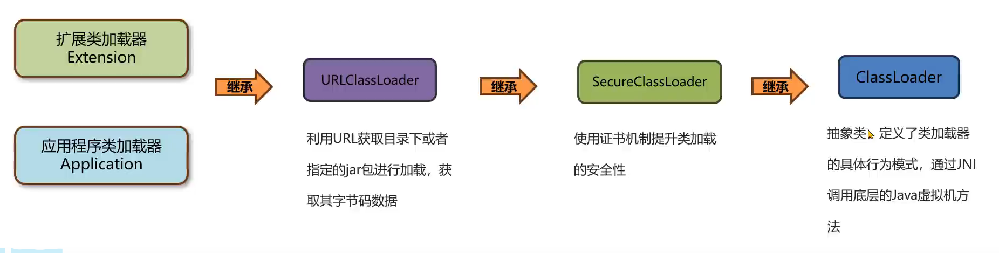
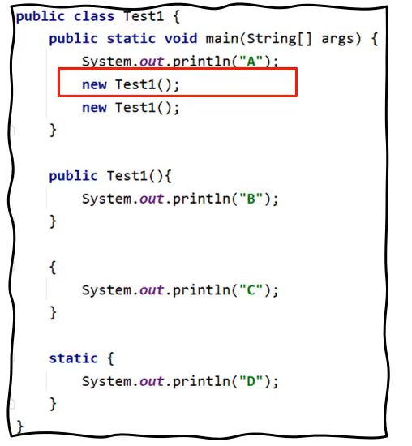
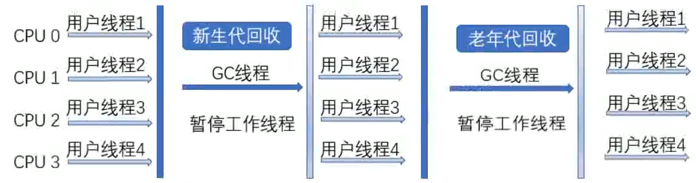
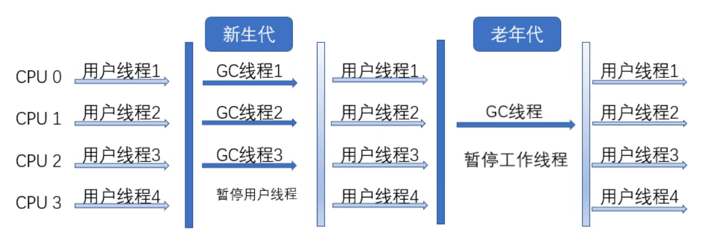
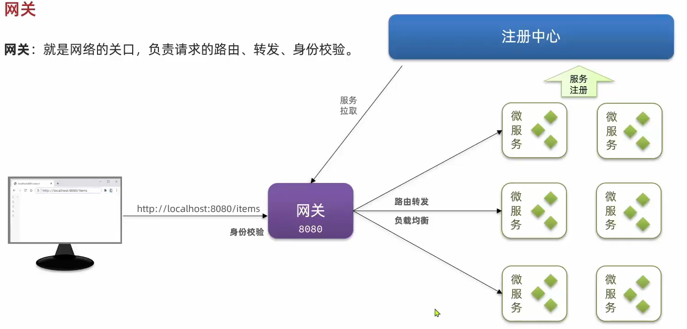

# JVM
JVM主要包含以下三大功能：  
- 解释运行  
- 内存管理  
- 即时编译
<!-- more -->  
## 类加载器  
**类加载器分类**

类加载器涉及到类的生命周期中的初始化阶段和连接中的解析阶段。三个类加载器：

类加载器分为有c++实现的启动类加载器Bootstrap，包含一些默认文件中存在的jar包，后续也可添加，例如使用String.class.getClassLoader()方法是无法查看的结果为null。   

第二种是java实现的扩展类加载器Extension和应用程序加载器Application。他们的源码都位于sun.misc.launcher中，是一个静态内部类，继承自URLClassLoader,具备通过目录或者指定jar包将字节码文件加载到内存中。应用程序加载器Application加载一些自己写的类以及第三方类，扩展类加载器Extension不重要，加载一些类例如java中可以加载jsp代码。  
      

且这三个类加载器互为父子。

**类的生命周期？**  

总共分为5个阶段：加载、连接、初始化、使用、卸载。而连接的过程又可以分为三个阶段：验证、准备、解析。  
1. 加载阶段： 类加载器在加载完类后，java虚拟机会将字节码中的信息(基本信息,常量池,字段,方法)保存在内存的方法区中,生成一个InstanceKlass对象(使用c++),保存类的所有信息,还包含多态信息.  同时,在堆中生成一份与方法区中数据类似的java.long.Class对象(使用java),作用是获取类的信息以及存储静态字段的信息。  
复制到堆的优点:只复制开发者可以访问的数据,更加安全。   
2. 连接阶段：分为三个流程，首先是验证，验证内容是否符合java虚拟机规范，然后是准备阶段，主要是给静态变量赋初值(final 变量直接赋值，否则赋值0)，最后是解析阶段，将常量池中的符号引用替换成指向实际数据的指针。  
3. 初始化阶段：初始化阶段执行静态代码中的代码，并为静态变量赋值。如下打印顺序为DACBCB。静态代码块(加载时候打印一次)->实例(局部)代码块->构造代码块.

对于继承类问题,访问父类的静态变量不需要初始化子类,初始化子类之前一定会初始化父类.    

**双亲委派机制？**    
  
主要解决一个类到底由哪个类加载器加载问题。双亲委派机制的作用如下：  、
1. 保证类加载的安全性：避免恶意代码替换JDK的核心类库例如String。  
2. 避免重复加载：避免一个类被多个类加载器加载。  
  
类加载过程：  
1. 向上查询：自底向上看父加载器是否加载了这个类，向上查如果加载过，则返回对象。
2. 向下委派：自顶向下尝试加载，主要看在不在自己的加载目录中，如果不在则委派给子类。 
  
**注意：**虽然逻辑上启动类加载器是拓展类加载器的父加载器，但是实际上查询拓展类加载器的父类时得到的是null，因为启动类加载器无法获得，拿不到他的对象。  

**打破双亲委派机制？**  

1. 自定义类加载器：    

类加载器中主要有这几个方法：loadClass，findClass，defineClass,resolveClass。其中loadClass方法中默认实现双亲委派机制，包括向上的查询，向下委派过程中主要通过findClass方法，其中校验这个类在不在负责的加载路径，然后调用defineClass，resolveClass主要负责类的连接和初始化。  
正确的去实现一个自定义类加载器的方法是重写findClass方法。如果想要打破双亲委派机制，只需要重写loadClass方法，去掉其中关于双亲委派的代码。
  
2. JDBC案例：  
  
JDBC加载不符合双亲委派机制，首先启动类加载器加载DriverManager，在初始化DriverManager时通过SPI机制加载jar包中的myql驱动(利用了线程上下文类加载器，通过Thread.currentThread().getContextClassLoader())。  
**但其实并没有打破双亲委派机制，没有重写loadClass方法。**

3. Osgi框架的类加载器：  
  
历史上的OSGI框架中，自身实现了打破，自定义类加载器可以委托另一个自定义类加载器。  
使用alrthas实现热部署(额外知识点)：  
- 程序启动后，字节码文件会恢复，除非class文件放入jar包更新  
- 热部署不能添加方法或字段，也不能更新正在执行的方法。
 

**JDK8以后的类加载器？**  
  
- 由于JDK9引入了module的概念，类加载器的设计发生了很多变化。  
1. 启动类加载器使用java编写，位于jdk.internal.loader.ClassLoaders类中。JAVA中的BootClassLoader继承自BUiltinClassLoader实现从模块中找到想要加载的字节码资源文件。**启动类加载器依然无法通过java代码获取，返回仍然是null。**  
2. 扩展类加载器被替换为平台类加载器，继承关系从URLClassLoader变成了BuiltinClassLoader，BuiltinClassLoader实现了从模块中加载字节码文件。**平台类加载器的存在更多时与老版本的设计兼容，自身没有特殊逻辑。** 
## 运行时数据区  
在Java虚拟机中，运行时数据区分为以下几类：  
- 线程共享：方法区，堆。(存在线程安全问题)
- 线程不共享：程序计数器，java虚拟机栈，本地方法区。  
1. **程序计数器**：  
  
  
程序计数器又叫PC寄存器，每个线程会通过程序计数器记录当前要执行的字节码指令地址。  
在字节码加载阶段，虚拟机会将字节文件中的指令读取到内存之后，会将源文件的偏移量转换为内存地址，每一条字节码指令都会拥有一个内存地址。在多线程执行情况下，Java虚拟机需要通过程序计数器记录CPU切换前解释执行到那一句指令并继续解释执行。  

2. **栈**：  
  
每一个线程都会包含一个自己的虚拟机栈。栈帧包括：  

- 局部变量表：保存的内容有：实例方法的this对象，方法参数，方法体内局部变量。栈帧中的局部变量表是一个数组，每一个位置称之为槽，long和double占了，其他占一个。**槽位是可以被复用的** 
- 操作数栈：在执行过程中用来存放临时数据的一块区域。int i =1 + 1，就会有深度为二的临时操作数栈存两个1。 
- 帧数据：帧数据主要包含动态链接、方法出口、异常表的引用。  
  
如果java虚拟机中栈帧过多，会产生内存溢出，
## 垃圾回收 
在Java中，垃圾回收器（    Garbage Collector）负责回收不再使用的对象。垃圾回收器是一个后台线程。  
1. 可达性分析：通过一系列成为"GC Roots"的对象开始，通过引用链找到所有可以访问到的对象。GC ROOTS包含：   
- 栈中引用的对象
- 方法区中静态属性引用的对象
- 方法区中常量引用的对象
- 本地方法栈JNI 引用的对象
2. 回收算法：    

**标记-清除算法**：产生大量内存碎片。    
**标记-整理算法**：无内存碎片。  
**复制算法**：将内存分为两块，每次只使用一块，当这一块用完，反复复制实现去除碎片。  
**分代垃圾回收**：分为新生代和老年代，新生代包含eden、survivor(包括from和to区)。  

   - Minor GC:也称为新生代GC，是针对新生代survivor区的垃圾回收。**采用复制算法**，开始全部放在伊甸区，存活下来进入form区并且年龄不断增大，from区被回收的进入to区等待下次垃圾回收，再回到from区(from和to来回互换，总比例8：1：1)。回收后进入老年区。
   - Full GC:也称为Major GC或老年代GC，是针对整个内存的垃圾回收。当老年代、元空间或者堆空间满时触发。**采用标记-整理算法**。  

3. 垃圾收集器：    

- Serial：最基本的收集器，单线程，回收效率高，需要STW。    
   
- ParNew：基于Serial的并行收集器，多线程，但需要STW。适合多cpu(单cpu线程切换需要开销)
  
**老年代也能并行，别的收集器**
- CMS：Concurrent Mark Sweep，并发标记-清除算法，分为四步：1.初始标记（仅仅标记GC ROOT关联的）-->2.并发标记--->3.并发清除--->4.并发复制。只有初始标记和并发标记需要STW。缺点：并发清除阶段垃圾无法清除产生浮动垃圾(浮动垃圾过多时候需要采用备胎Serial)，大量垃圾碎片。

- G1：Garbage Fisrt，默认的垃圾收集器。化整为零，将内存化为上千个部分，采用分代回收，灵活分配。
