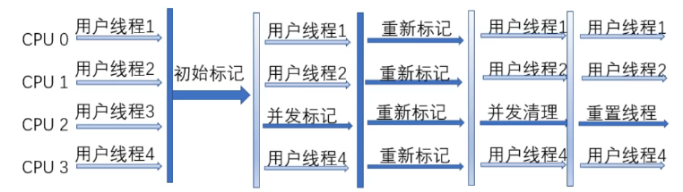
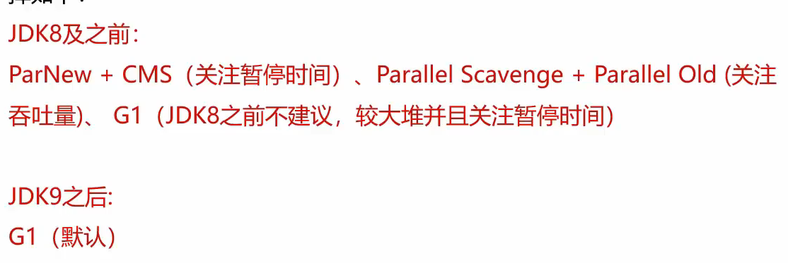

# JVM
JVM主要包含以下三大功能：  
- 解释运行  
- 内存管理  
- 即时编译
<!-- more -->  
## 类加载器  
**类加载器分类**

类加载器涉及到类的生命周期中的初始化阶段和连接中的解析阶段。三个类加载器：

类加载器分为有c++实现的启动类加载器Bootstrap，包含一些默认文件中存在的jar包，后续也可添加，例如使用String.class.getClassLoader()方法是无法查看的结果为null。   

第二种是java实现的扩展类加载器Extension和应用程序加载器Application。他们的源码都位于sun.misc.launcher中，是一个静态内部类，继承自URLClassLoader,具备通过目录或者指定jar包将字节码文件加载到内存中。应用程序加载器Application加载一些自己写的类以及第三方类，扩展类加载器Extension不重要，加载一些类例如java中可以加载jsp代码。  
      

且这三个类加载器互为父子。

**类的生命周期？**  

总共分为5个阶段：加载、连接、初始化、使用、卸载。而连接的过程又可以分为三个阶段：验证、准备、解析。  
1. 加载阶段： 类加载器在加载完类后，java虚拟机会将字节码中的信息(基本信息,常量池,字段,方法)保存在内存的方法区中,生成一个InstanceKlass对象(使用c++),保存类的所有信息,还包含多态信息.  同时,在堆中生成一份与方法区中数据类似的java.long.Class对象(使用java),作用是获取类的信息以及存储静态字段的信息。  
复制到堆的优点:只复制开发者可以访问的数据,更加安全。   
2. 连接阶段：分为三个流程，首先是验证，验证内容是否符合java虚拟机规范，然后是准备阶段，主要是给静态变量赋初值(final 变量直接赋值，否则赋值0)，最后是解析阶段，将常量池中的符号引用替换成指向实际数据的指针。  
3. 初始化阶段：初始化阶段执行静态代码中的代码，并为静态变量赋值。如下打印顺序为DACBCB。静态代码块(加载时候打印一次)->实例(局部)代码块->构造代码块.

对于继承类问题,访问父类的静态变量不需要初始化子类,初始化子类之前一定会初始化父类.    

**双亲委派机制？**    
  
主要解决一个类到底由哪个类加载器加载问题。双亲委派机制的作用如下：  、
1. 保证类加载的安全性：避免恶意代码替换JDK的核心类库例如String。  
2. 避免重复加载：避免一个类被多个类加载器加载。  
  
类加载过程：  
1. 向上查询：自底向上看父加载器是否加载了这个类，向上查如果加载过，则返回对象。
2. 向下委派：自顶向下尝试加载，主要看在不在自己的加载目录中，如果不在则委派给子类。 
  
**注意：**虽然逻辑上启动类加载器是拓展类加载器的父加载器，但是实际上查询拓展类加载器的父类时得到的是null，因为启动类加载器无法获得，拿不到他的对象。  

**打破双亲委派机制？**  

1. 自定义类加载器：    

类加载器中主要有这几个方法：loadClass，findClass，defineClass,resolveClass。其中loadClass方法中默认实现双亲委派机制，包括向上的查询，向下委派过程中主要通过findClass方法，其中校验这个类在不在负责的加载路径，然后调用defineClass，resolveClass主要负责类的连接和初始化。  
正确的去实现一个自定义类加载器的方法是重写findClass方法。如果想要打破双亲委派机制，只需要重写loadClass方法，去掉其中关于双亲委派的代码。
  
2. JDBC案例：  
  
JDBC加载不符合双亲委派机制，首先启动类加载器加载DriverManager，在初始化DriverManager时通过SPI机制加载jar包中的myql驱动(利用了线程上下文类加载器，通过Thread.currentThread().getContextClassLoader())。  
**但其实并没有打破双亲委派机制，没有重写loadClass方法。**

3. Osgi框架的类加载器：  
  
历史上的OSGI框架中，自身实现了打破，自定义类加载器可以委托另一个自定义类加载器。  
使用alrthas实现热部署(额外知识点)：  
- 程序启动后，字节码文件会恢复，除非class文件放入jar包更新  
- 热部署不能添加方法或字段，也不能更新正在执行的方法。
 

**JDK8以后的类加载器？**  
  
- 由于JDK9引入了module的概念，类加载器的设计发生了很多变化。  
1. 启动类加载器使用java编写，位于jdk.internal.loader.ClassLoaders类中。JAVA中的BootClassLoader继承自BUiltinClassLoader实现从模块中找到想要加载的字节码资源文件。**启动类加载器依然无法通过java代码获取，返回仍然是null。**  
2. 扩展类加载器被替换为平台类加载器，继承关系从URLClassLoader变成了BuiltinClassLoader，BuiltinClassLoader实现了从模块中加载字节码文件。**平台类加载器的存在更多时与老版本的设计兼容，自身没有特殊逻辑。** 
## 运行时数据区  
在Java虚拟机中，运行时数据区分为以下几类：  
- 线程共享：方法区，堆。(存在线程安全问题)
- 线程不共享：程序计数器，java虚拟机栈，本地方法区。  
1. **程序计数器**：  
  
  
程序计数器又叫PC寄存器，每个线程会通过程序计数器记录当前要执行的字节码指令地址。  
在字节码加载阶段，虚拟机会将字节文件中的指令读取到内存之后，会将源文件的偏移量转换为内存地址，每一条字节码指令都会拥有一个内存地址。在多线程执行情况下，Java虚拟机需要通过程序计数器记录CPU切换前解释执行到那一句指令并继续解释执行。  

2. **栈**：  
  
每一个线程都会包含一个自己的虚拟机栈。栈帧包括：  

- 局部变量表：保存的内容有：实例方法的this对象，方法参数，方法体内局部变量。栈帧中的局部变量表是一个数组，每一个位置称之为槽，long和double占了，其他占一个。**槽位是可以被复用的** 
- 操作数栈：在执行过程中用来存放临时数据的一块区域。int i =1 + 1，就会有深度为二的临时操作数栈存两个1。 
- 帧数据：帧数据主要包含动态链接、方法出口、异常表的引用。  
  
如果java虚拟机中栈帧过多，会产生内存溢出

3. **堆**：  

堆空间中有三个需要关注的值且线程共享：used，total和max，used是指当前已经使用的堆内存，total是java虚拟机中已经分配的可用堆内存，
max是java虚拟机中可以分配的最大堆内存。在服务端程序开发时，建议将total和max设置成相同的值。  
  

**堆的回收**

- 引用计数器法：缺点是每次引用和取消引用都需要维护计数器，而且存在循环引用问题，即使栈内存已经无法引用到堆中对象了，但计数器仍不为0。无法回收出现内存泄漏。    
- 可达性分析： 见垃圾回收章节
- 几种常见的对象引用：强引用(可达性算法)、软引用、弱引用、虚引用、终结器引用。
   - 软引用：当程序内存不足时，会将软引用中数据进行回收，常用于缓存中，通过new SoftReference创建软引用对象。  
   - 弱引用：gc时会被回收，通过new WeakReference创建弱引用对象。一般不会使用，ThreadLocal中会使用到。
   - 虚引用： 任何时候都能回收。

4. **方法区(元数据区)**：  
  
方法区存放基础信息，主要包含三个部分：类的元信息，运行时常量池和字符串常量池。
- 类的元信息即加载阶段的InstanceKlass对象。
- 运行时常量池主要区别于静态常量池(磁盘中编译生成的.class文件)，他是静态常量池通过加载连接的得到的可以通过真实内存地址快速定位到常量的。在jdk7之前放在堆中的永久代，之后放在元空间。且元空间脱离jvm虚拟机上限，由操作系统管理。元空间最大大小可以限制，而且会发生内存溢出。
- 字符串常量池保存代码中定义的常量字符串内容，在定义字符串时可以选择加new或者不加来选择放在堆中还是字符串常量池中。而在使用加号运算字符串时因为底层用的是StringBuilder，所以会放到堆内存中，  

jdk7之前静态变量放在方法区中，jdk8之后放在堆中Class对象中。   
**方法区的回收**中，判定一个了类可以被卸载需要满足三个条件：  
1. 类中所有实例对象都已被回收，再堆中不存在任何改类的实例对象以及子类对象。  
2. 加载该类的类加载器已被回收。  
3. 该类的java.long.Class对象没有任何地方引用。  

5. **直接内存**：  
  
直接内存的使用主要为了解决以下问题：  
- 堆中对象垃圾回收时会影响性能。
- IO操作时需要把文件先读入内存，再复制到堆中。直接存内存减小了数据复制的开销。

## 垃圾回收 
在Java中，垃圾回收器（Garbage Collector）负责回收不再使用的对象。垃圾回收器是一个后台线程。  
1. 可达性分析：通过一系列成为"GC Roots"的对象开始，通过引用链找到所有可以访问到的对象。GC ROOTS包含：   
- 栈中引用的对象(线程对象)
- 系统类加载器加载的java.long.Class对象，launcher
- 监视器对象，同步锁锁持有的对象
- 方法区运行时常量池和静态属性(类的元信息)引用的对象
- 本地方法JNI引用的对象
2. 回收算法：    

**标记-清除算法**：产生大量内存碎片，且分配速度慢    
**标记-整理算法**：无内存碎片。内存使用率高，但整理阶段效率不高   
**复制算法**：将内存分为两块，每次只使用一块，当这一块用完，反复复制实现去除碎片。吞吐量高，只需要一次遍历，但是内存使用率低    
**分代垃圾回收**：分为新生代和老年代，新生代包含eden、survivor(包括from和to区)。  

   - Minor GC:也称为新生代GC，是针对新生代survivor区的垃圾回收。**采用复制算法**，开始全部放在伊甸区，存活下来进入form区并且年龄不断增大，from区被回收的进入to区等待下次垃圾回收，再回到from区(from和to来回互换，总比例8：1：1)。回收后进入老年区。
   - Full GC:也称为Major GC或老年代GC，是针对整个内存的垃圾回收。当老年代、元空间或者堆空间满时触发。当老年代空间不足是首先进行Minor GC，再不行才会使用full GC(尽管年龄不到，但是新生代不够只能放老年代)**采用标记-整理算法**。  

3. 垃圾收集器：    

- Serial：最基本的收集器，单线程，回收效率高，需要STW。    
   
- ParNew：基于Serial的并行收集器，多线程，但需要STW。适合多cpu(单cpu线程切换需要开销)
  
**老年代也能并行，别的收集器**
- CMS：Concurrent Mark Sweep，并发标记-清除算法，分为四步：1.初始标记（仅仅标记GC ROOT关联的）-->2.并发标记--->3.并发清除--->4.并发复制。只有初始标记和重新标记需要STW。缺点：并发清除阶段垃圾无法清除产生浮动垃圾(浮动垃圾过多时候需要采用备胎Serial)，大量垃圾碎片,退化问题。

- G1：Garbage Fisrt，默认的垃圾收集器。化整为零，将内存化为上千个部分，采用分代回收，灵活分配，使用复制算法。

总的来说：堆使用效率、吞吐量、以及最大暂停时间不可兼得。堆内存越大，最大暂停时间越长，想要减少最大暂停时间需要减低吞吐量。

## 内存泄漏  
内存泄漏主要是因为引用没有及时释放，导致对象无法被回收。

**代码中的内存泄漏**  
  
1. 没有重写equals和hashCode方法导致。  

比如hashMap中主键为对象的情况，如果hashCode方法没有重载，会导致相同id的学生对象计算出来的hash值不同，如果equals没有实现，会导致即使id相同也无法判定为同一对象，在长时间运行时会产生大量相同id的学生数据。

2. 引用局部内部类导致。

创建内部类时，内部类会自动调用其外部类，导致其外部类无法被回收。匿名内部类对象如果是非静态创建，会持有其调用者对象，垃圾回收无法回收其调用者。解决方法是将内部类改为静态内部类。  

3. ThreadLocal的错误使用。
  
ThreadLocal使用内部类ThreadLocalMap来存储每个线程的变量副本。ThreadLocalMap是一个定制化的哈希表，其中的键（key）是ThreadLocal实例的弱引用，值（value）是实际存储的对象。弱引用在gc时无论是否充足都会回收。

4. String的intern方法导致(内存溢出)。
  
jdk6中字符串常量池位于堆内存永久代而不是方法区中，且他不会被清理，就会导致内存泄漏。

5. 使用静态字段保存对象。  
  
如果大量的数据在静态变量中被长期引用，数据就不会被释放，如果这些数据不在使用就会发生内存泄漏。  

解决方案：  
- 不再使用将静态变量置为null。  
- 使用单例模式时，尽量使用懒加载，而不是立即加载。
- Spring的Bean中不要长期存放大对象。

6. 资源没有正常关闭  
  
连接和流这些资源会占用内存，如果使用完后没有关闭，这部分内存不一定会发生内存泄漏，因为可能没使用静态变量，解决方法时在finally中关闭，或放在try代码块中。

**高并发产生的内存泄漏**   

大量的并发请求或者大量积压导致。解决方案：定位到对象是由哪一个端口产生的。