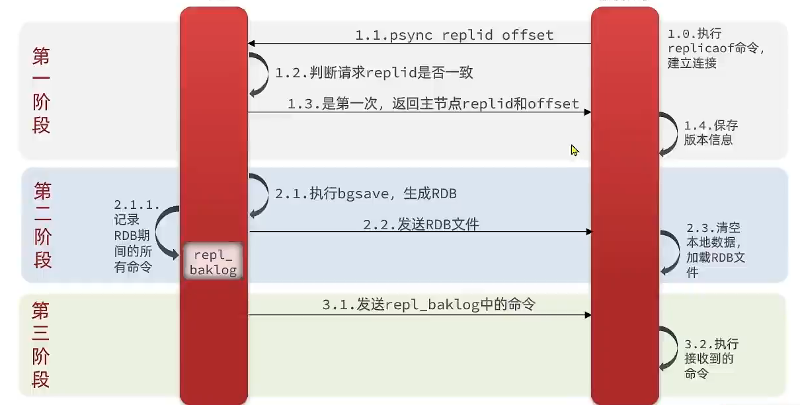
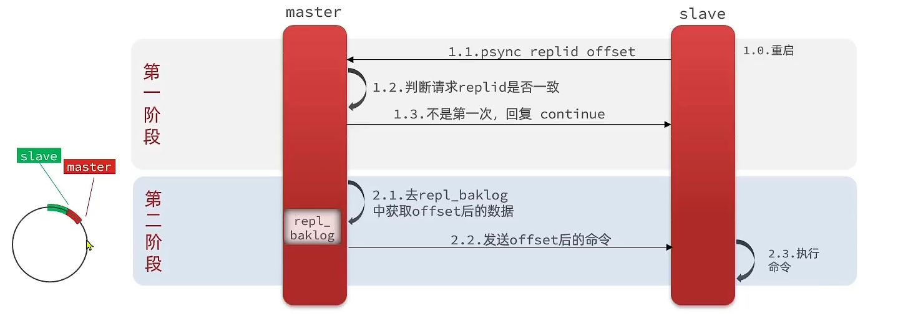
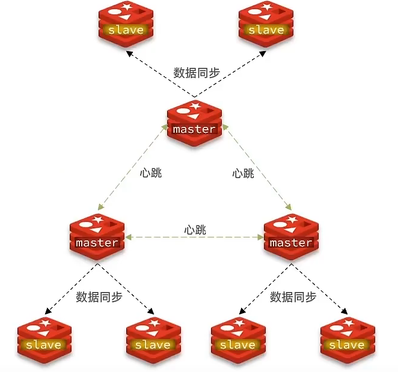
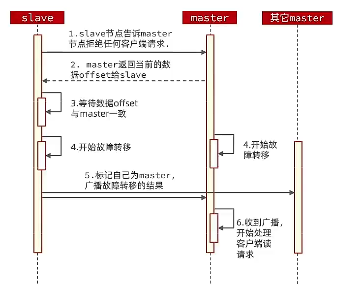

# Redis
<!-- more -->  
## 代码实现  
  


1. **字符串**    
  
Redis对象头结构：  
```C
struct RedisObject{
  int4 type;
  int4 encoding;
  // 最后访问的时间
  int24 lru;
  // 引用数
  int32 refcount;
  void *ptr;
} robj
```  
String头：SDS(simle dynamic string)
```C
struct SDS<T>{
  T capacity; // SDS分配的总空间长度
  T len;    // 数组长度
  byte flag;
  byte[] content; // 内容
}
```    
字符串存储分为两种存储方式分别应对短的没修改过的数据embstr（44字节）和长的raw，其中raw编码方式相较于embstr编码方式更灵活，主要体现在以下几个方面：  
- embstr编码的字符串对象在创建时，RedisObject对象和SDS（Simple Dynamic String）对象是连续存放在一块内存空间中的，只需要一次内存分配。raw编码的字符串对象则需要分别创建RedisObject对象和SDS对象，因此需要两次内存分配。这种分开分配的方式使得raw编码在处理大型字符串时更为灵活。
- embstr编码的字符串对象内存是连续的，而raw编码的字符串对象内存不一定是连续的。这种非连续性使得raw编码在内存布局上更为灵活。
- embstr编码的字符串对象是不可修改的，一旦需要修改（例如通过APPEND命令），就会转换成raw编码
。raw编码的字符串对象允许进行修改操作，因此提供了更高的灵活性。  

2. **字典**
  ```C
  struct dict{
    ...
    dictht ht[2];
  }
  ```
redis的字典结构中包含两个hashtable，hashtable的实现同java的hm，数组加链表。两个hashtable分别记录存储新旧两个表，主要是便于扩容 Redis 字典在进行扩容时采用的是渐进式 rehash 机制。以下是这一过程的主要步骤：  
  1. 为新哈希表分配空间：  
    如果是扩展操作，新哈希表（ht[1]）的大小会是第一个大于等于 ht[0].used * 2 的 2 的幂次方。
  2. 将保存在旧哈希表（ht[0]）中的所有键值对 rehash 到新哈希表（ht[1]）中  
  3. 渐进式 rehash：
  在 rehash 进行期间，每次对字典执行增删改查操作时，程序在执行客户端指定操作之外，还会将 ht[0] 在 rehashidx 索引上的所有键值对 rehash 到 ht[1]，然后将 rehashidx 的值加一。也就是从 ht[0] 的第一个索引位置开始，将这个索引位置上的所有 entries 拷贝到 ht[1] 中，接着依次处理下一个哈希桶。随着字典操作的不断执行，ht[0] 的所有键值对最终会全部移动到 ht[1]。此时程序会将 rehashidx 设为 -1，释放 ht[0] 的空间，并将 ht[1] 设置为 ht[0]，新建空白的哈希表 ht[1]，以备下次 rehash 使用。

3. **列表**  

列表分的比较多有压缩列表ziplist，双向链表linkdlist，快速列表quicklist和跳跃列表skiplist，讲下zset的底层：zset是一个复合结构，由hash和skiplist复合而成，hash结构用来存储value和score，而skiplist则用来维护value的顺序。Redis的跳表有64层，容纳很多元素可以。


## Redis基础  
1. **阻塞读、非阻塞I/O与多路复用**

其中非阻塞IO和多路复用为Redis单线程但高效的原因。
- 单线程的理解：Redis 的单线程是指它的数据处理和命令执行是在单个主线程中顺序处理的。个设计简化了 Redis 的内部复杂性，因为不需要处理多线程编程中的锁和同步问题，同时也减少了线程上下文切换的开销。**然而，这并不意味着 Redis 完全不使用多线程**。一些后台任务例如持久化会fork新的进程执行，与主进程并发运行。尽管 Redis 的主线程是单线程的，但它使用多路复用技术。在 Redis Sentinel 模式中，Sentinel 进程本身是多线程的，用于监控 Redis 主从服务器的状态。
- 文件描述符： 每个网络连接都有一个对应的文件描述符。redis服务器维护着客户端连接的文件描述符列表，并监控这些文件描述符上的数据。  
- 事件通知： **操作系统**提供了时间通知机制，允许进程等待特定的事件(如数据到达)发生，而不是不断轮询。  
- **非阻塞I/O**: 这里的非阻塞针对的是**服务器**，且不论读写，而不是客户端，这意味着服务器在处理客户端请求时，不会因为等待 I/O 操作（如读写网络数据）而停滞不前。服务器可以同时处理多个客户端连接和请求，这是通过事件驱动编程和多路复用技术（例如 epoll 在 Linux 上）实现的。  
- **多路复用**：主要是服务器端的操作，Redis 服务器使用多路复用技术（如 select、poll、epoll 等）来同时监控多个文件描述符。允许服务器在一个线程内同时等待多个网络事件，而不需要为每个连接创建一个线程。即**一个线程干多个线程的活**。  
- 阻塞读：主要是针对**客户端**，当客户端写入一个阻塞命令如blpop时，redis服务器会将客户端的文件描述符标记为阻塞状态，并在内部将这个文件描述符添加到待监测列表。当其他客户端向指定键发送数据后，如lpush，操作系统会通知redis服务器对应的文件描述符可读。 


2. **scan**  

scan主要基于游标与正则进行遍历，并且可以指定每次返回的数量。每次再次输入命令时需要输入上次的游标。主要传入三个参数，cursor（游标），第二个是key的正则模式，第三个是limit，表示需要遍历的槽位数。
在redis中所有的key都存储在一个很大的字典中，类似java中hashmap，每一次一维数组扩容翻倍。scan指令返回的游标就是一维数组的位置索引，这个位置索引被称为槽(slat)。之所以返回的结果可能多可能少，是因为不是所有槽位都拉了链表。每一次遍历都会将limit数量的槽位上挂接的所有链表元素进行模式匹配过来后，一次性返回。


3. **管道** 
  
Redis 管道技术可以在服务端未响应时，客户端可以继续向服务端发送请求，并最终一次性读取所有服务端的响应。比如说在客户端中，管道可以把写-读-写-读转换为写-写-读-读的顺序，原本需要花费两个网络来回，现在只需要花费一个，服务端没有区别对待，客户端通过对管道改变读写顺序，可以减少大量IO时间。  


4. **事务**

redis事务需要三个命令，分别是multi,exec和discard。分别对应begin，commit和rollback。multi指示事务的开始，exec命令发出后执行所有输入的命令。但是redis事务并不是**原子性**的，仅仅满足了事务的隔离性中的串行化-当前知情的事务有着不被其他事务打断的权利。**但是可以用watch()命令进行优化，它是一个乐观锁。**需要用在multi之前。java中可以用redis.watch。

5. **pubsub**  
  
redis的pubsub机制是异步的，并且是消费多播的，首先发布者和消费者是两个分别的连接，其次消息多播允许生产者只生产一次消息，有中间件负责将消息负责到多个消息队列。每个消息队列相互解耦，多个消费者互不干扰。消费者可以使用轮询，也可以**借鉴blpop进行阻塞读取**，使用listen阻塞监听。**缺点**：消息发送后会立即送到订阅者，不会保留消息。    

6. **Stream**

Stream是redis5.0之后才出现的，它将数据以流式方式存储，可以理解为消息队列。借鉴kafka，消息是持久化的，每个stream可以挂多个消费组，每个消费组有个游标往前移动，且消费组互不影响，同一份消息可以被多个消费组消费。消息id是时间戳，消息内容是n个键值对，类似json。


7. **内存管理**    

redis内存分页存储，内存分配需要用适当的算法划分内存页，还需要分配内存碎片比较麻烦，因此redis直接当甩手掌柜，将内存分配任务交给了第三方库jemalloc库来管理内存。通过info memory查看。  
内存回收机制：redis并不是将空闲内存立即归还个操作系统，因为分页的原因，如果页面上只要有一个key在使用就不会回收。虽然redis无法保证立即回收已经删除的key的内存，但是会重新使用未分配的内存。  

```python
client = redis.StrictRedis()
p = client.pubsub()
p.subscribe('...')
## 轮询  
while True:
  msg = p.get_message()
## 阻塞
for msg in p.listen():
  print(msg)
```
  
8. **过期策略**  
 
  
- 过期key策略：    
  
  redis会将所有设置了过期时间的key放在一个统一的字典中，分为**定时扫描策略**和**惰性策略**，定时扫描策略采用贪心算法，一般过10s会进行扫描20个key，如果过期的超过四分之一则再扫描。惰性策略是在客户端访问某个key的时候，会进行时间扫描。


- 内存满了怎么办：  
  
  通常考虑不在请求redis，采用lru淘汰key或者采用ttl算法淘汰key，其中lru的实现方法：基于链表实现，不常访问的会放在链表的结尾，直接淘汰。采用hash表对链表中元素进行定位，实现O(1)的元素移动。ttl：优先淘汰快到期的。  

- 惰性删除：  
  
  删除主要是基于del命令，主要是防止删除的对象内有太多数据导致单线程卡顿，因此引入了unlink指令，对删除操作进行懒处理，丢给后台的线程来异步回收内存。对于flush命令也可以通过加入async后缀实现惰性删除。sy
  


## 分布式
**CAP原理**  


  
CAP原理好比分布式领域的牛顿定律是分布式的基石头，C: 一致性，A: 可用性，P:  partition tolerance 分区容错性。redis主从集群不满足一致性，满足可用性和最终一致性。

**Redis如何做数据持久化？**
  
  
RDB持久化，全程Redis Database Backup file，又称快照同步，有可能数据丢失。在服务终止时会执行save命令自动保存加载到磁盘。并且内部有RDB的自动触发机制，在conf文件中配置，会根据情况自动执行bgsave命令保存数据。bgsave会fork一个子进程，然后子进程执行save命令，父进程继续执行，实现异步保存。  
  
AOF持久化，全称Append Only File，追加文件，Redis处理的每一个写命令都会记录到AOF文件中。该功能默认关闭，记录频率比RDB高，一般采用每秒同步一次的方案。  

**Redis主从架构**  

Redis做主从架构不做负载均衡的原因，是因为Redis是读多写少，因此采用主从架构，只在主里面写。通过 从节点 slaveof 主机号 端口号，来实现。  


数据全量同步原理：  
  
     

- Replication id:是数据集的标记，id一致则说明是同一个数据集。每一个master都有唯一的replid，salve会继承master的replid。
- Offset：数据集的偏移量，随着记录在repl_baklog中的数据增多而逐渐增大，为了判断同步进度。   
如何判断第一次？ 判断申请同步时候Replication是否一致。    

增量同步：主从第一次同步是全量同步，但如果slave重启后同步，则执行增量同步。  
   
  
可以从下面几个方面优化redis主从集群：    

- 在master中配置repl-diskless-sync yes启用无磁盘复制，避免全量同步时的磁盘io。
- 减小Redis单节点的内存占用，减小RDB导致的磁盘io
- 增大repl_baklog大小，发现宕机，尽快恢复
- 限制一个master上的slave数量，可采用主-从-从链式结构，减少master的压力   

**Redis哨兵集群**
哨兵是Redis的一个组件，一般有3到五个节点组成，它负责监控Redis的主从节点，当主节点挂掉时，哨兵会自动切换新的主节点，保证服务的可用性。基于心跳检测服务状态  

- 主观下线：单个或几个哨兵认为主机挂了。
- 客观下线：超多个哨兵认为主机挂了。

如何配置：更改相关配置文件，启动哨兵监控整个集群，在java后台application.ymal中不再配置redis连接池，而是配置sentinel。    

```ymal
Spring:
  redis:
    sentinel:
      master: mymaster #指定master名称
      nodes: # 指定redis-sentinel集群信息
        - 192.168.1.1:26379
        - 192.168.1.2:26380
```  
同时需要配置bean配置类，这里省略。  

**分片集群结构**  
  
主从和哨兵解决高并发、高并发读的问题，但是无法解决海量存储，高并发写的问题，因此需要用到分片集群多个master。而且多个master之间互相监控。通过主节点写，从节点读实现读写分离。  
    
  

1. 散列插槽： 

redis会把每一个master节点映射到16384个插槽上，平分到master，redis中key不与节点绑定，而是与插槽绑定。根据一定的hash算法将key映射到插槽，插槽与节点一一对应。  

如何将同一类数据保存在同一个redis实例？？？  
  
key可以都以{typeId}为前缀，对于有花括号的，插槽映射时候只会拿花括号内部分进行映射。  

2. 集群伸缩：  

即添加或删除节点，当添加节点是需要告知一个已存在的主机和端口号。然后还需要将**插槽从已存在的端口上削减转移一部分到新节点上。**
  
3. 故障转移：  

自动具备故障切换，当master宕机后，选择一个从节点作为新的master，重启后变成slave。利用cluster failover命令可以手动让集群中某个master宕机
实现无感知的数据迁移。  
  

4. RedisTemplate配置：    

```ymal
spring:
  redis:
    cluster:
      nodes:
       192.168.1.1:7000,
       192.168.1.2:7001,
       192.168.1.3:7002
       ....
```  


**红锁redlock**
  
redlock算法主要是防止主从关系中主刚拿到锁就挂了的情况，很多库已经对他进行了封装，使用时需要提供多个或全部redis实例。上锁是，会向过半节点发送set(key，value，nx = True，ex=xxx) 指令，只要过半set成功就认认为上锁成功，释放锁时需要向所有节点发送del指令。 

