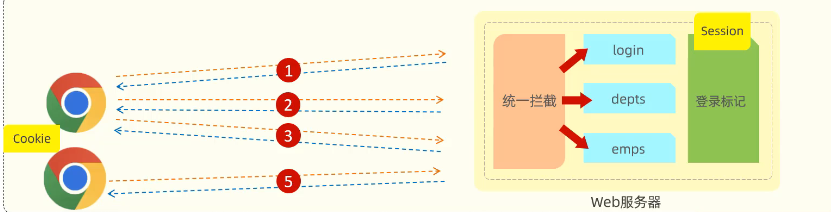
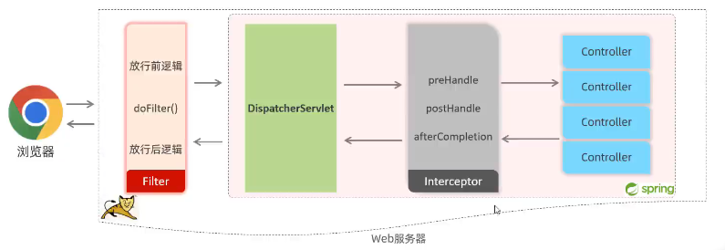

# Spring
笔记未完成状态。
<!-- more -->
Spring特点有：  
- MVC三层架构：  
  **1.controller**:控制层，接受前端发送的请求，对请求进行处理，并响应数据。  
  **2.service**：业务逻辑层，处理具体的业务逻辑。  
  **3.dao**：数据访问层/持久层(Data Access Object，负责对数据库的访问操作，包括增删改查。 
- IOC&DI:  
  **1.IOC(Inversion Of Control)**:对象的控制权由程序自身转移到外部容器，实现解耦。  
  **2.DI(Dependency injection)**:容器为应用程序提供运行时，所依赖的资源，成为依赖注入。  
  **3.Bean对象**:IOC外部容器中所创建、管理的对象。
- 面向切面编程（AOP）:  
  1.连接点：Joinpoint，可以被AOP控制的方法  
  2.通知：Advice，重复的逻辑，也就是公用的控制方法  
  3.切入点：Pointcut，匹配连接点的条件，通知仅在切入点方法执行时应用。 

## 会话技术
  
登陆过程需要建立一次会话，因为HTTP协议是无状态的，在一次会话中可以包含多次请求和响应。
- 会话跟踪:一种维护浏览器状态的方法，服务器需要识别多次请求是否来自于同一浏览器，以便在同一次会话的多次请求间共享数据。
- 会话跟踪方案：
    - 客户端会话跟踪技术：Cookie
        - 优点：HTTP协议自带结束
        - 缺点：移动端无法使用，不安全，用户可以自己禁用，且cookie不能跨域。
    - 服务端会话跟踪技术： Session
        - 优点：存储在服务端，更安全
        - 缺点：服务器集群环境无法使用，cookie的缺点。
    - 令牌技术
        - 优点：支持多端，集群环境，减轻服务器端存储压力。
        - 缺点：需要自己实现。
### JWT令牌
全称：JSON Web Token
### Filter过滤器
是Java Servlet规范的一部分，可以通过实现javax.servlet.Filter接口来创建。作用于Servlet之前，可以对几乎所有的请求进行拦截，包括静态资源（如图片、CSS、JS等）。  
- 拦截执行过程：  
1.执行放行前逻辑。  
2.放行。  
3.在web服务器中实现与web资源的交互。  
4.放行之后的逻辑。
- 拦截路径：   
1./login(单个)   
2./depts/(多个)  
3./(全部)  
### Interceptor拦截器  
是Spring框架提供的一个概念，可以通过实现org.springframework.web.servlet.HandlerInterceptor接口或使用@Interceptor注解来创建。作用于Spring的DispatcherServlet之后，只对经过DispatcherServlet的请求有效，通常不包括静态资源。         
  
### 消息转换器
Spring 的消息转换器（HttpMessageConverter）主要负责将请求报文绑定为方法中的形参对象，以及将方法的返回值转换为 HTTP 响应的内容。当 Controller 方法返回一个对象时，Spring MVC 使用消息转换器将该对象转换为 HTTP 响应体的内容
。消息转换器负责将 Java 对象转换为特定的媒体类型，例如 JSON、XML、HTML 等。  
Spring 还允许通过 extendMessageConverters 方法在配置转换器后扩展或修改转换器列表
。这可以用于添加自定义转换器或者在默认转换器注册后插入自定义转换器。(例如可以自动修改日期格式)
#### 请求类型
- 实体参数  
使用方法：通过创建实体类,传入参数```User user```，类中创建get，set方法以及tostring。
- 数组参数  
使用方法：  
  - 传入参数```String[] name```  
  - 传入参数```@RequestParam List<String> name```
- 日期参数  
使用方法： ```@DateTimeFormat(patterm=yyyy-MM-dd HH:mm:ss)LocalDateTime updatetime```
- json参数  
使用方法：同实体参数不过加入注解,```@Requestbody User user```
- 路径参数  
使用方法：
```Java
@RequestMapping("/path/{id}/{name}")
public String path(@PathVariable Integer id, @PathVariable String name){}
```
- 统一响应  
使用方法：通过构造实体类以包含各种类型的数据，Integer,String等，```Public "自定义类" name（类名）```,通过写入get，set方法进行包装。

## SpringBoot
笔记未完成状态。
<!-- more --> 
### 配置文件  
支持三种格式配置文件：application.properties，application.yml，application.yaml。优先级依次降低。(yml是主流)
### 自动配置
- 方案一：@ComponentScan，通过该注解，只能扫到包内bean。（使用繁琐）  
- 方案二：@Import导入，使用该注解导入的类会被加载导IOC容器内。并且可以使用@Enablexxxx注解，封装@Import注解。   
### 注解
- ```@SpringBootApplication```  
启动类注解由三部分组成：  
    - ```@SpringBootConfiguration```：声明是一个配置类，因此是可以引入Bean对象的。  
    - ```@ComponentScan```  
    - ```@EnableConfiguration```：主要通过封装@Import注解实现。  
- ```@Conditional```  
作用到方法或类之上，按照一定条件进行判断，符合条件才会注册Bean对象到IOC容器中。  
## Spring Cash
Spring Cash是一个框架，实现了基于注解的缓存功能，只需要加一个注解，就能实现缓存功能。
Spring Cash提供了一层抽象，底层可以切换不同的缓存实现，例如EHCash，Caffeine，Redis。以下为一些注解：  

```@EnableCashing:```开启缓存功能，通常加在启动类上  
```@Cacheable:```在方法执行前查询缓存中是否有数据，通常加载方法上。如果有则返回，无则调用方法放入缓存(既能取又能放，常用于查询)  
```@CachePut:```将方法的返回值放到缓存中(常用于增加)  
```@CacheEvict:```将一条或多条数据从缓存删除(常用于数据库删除方法)  
使用方法示例：
```Java
@CachePut(cacheNames="userCache",key="#user.id"/key="result.id"(返回结果)/key="p0/a0.id")(第一个参数)
// @Cahceable同理，可用于查询数据库方法。
```  
## Spring Task 
是一个很小的框架，甚至不需要maven手动导入，只需要在项目启动类通过添加注解```@EnableScheduling```即可启动。  
- 使用方法：通过在方法上使用注解```@Scheduled(cron = '..')```使用，其中cron表达式可以在线生成。
### cron表达式  
cron表达式其实是一个字符串，通过cron表达式可以**定义任务触发的时间**  
构成规则：分为6或7个域，用空格隔开，分别代表：秒、分钟、小时、日、月、周、年(可选)     

在<a href="https://cron.qqe2.com/" target="_blank">在线Cron表达式生成器</a>里可以根据需要自动生成所需要的表达式。