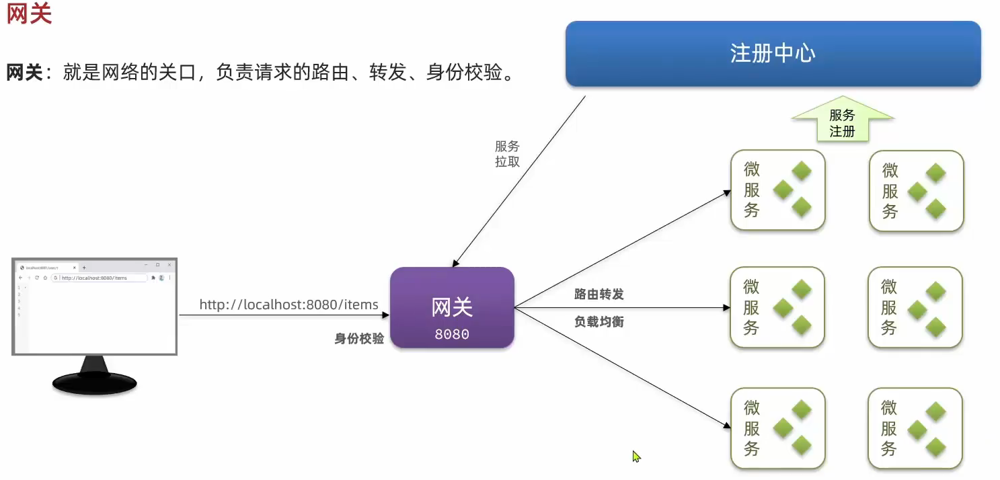

# Spring
笔记未完成状态。
<!-- more -->
Spring特点有：  
- MVC三层架构：  
  **1.controller**:控制层，接受前端发送的请求，对请求进行处理，并响应数据。  
  **2.service**：业务逻辑层，处理具体的业务逻辑。  
  **3.dao**：数据访问层/持久层(Data Access Object，负责对数据库的访问操作，包括增删改查。 
- IOC&DI:  
  **1.IOC(Inversion Of Control)**:对象的控制权由程序自身转移到外部容器，实现解耦。  
  **2.DI(Dependency injection)**:容器为应用程序提供运行时，所依赖的资源，成为依赖注入。  
  **3.Bean对象**:IOC外部容器中所创建、管理的对象。
- 面向切面编程（AOP）:  
  1.连接点：Joinpoint，可以被AOP控制的方法  
  2.通知：Advice，重复的逻辑，也就是公用的控制方法  
  3.切入点：Pointcut，匹配连接点的条件，通知仅在切入点方法执行时应用。 
## SpringMvc  
Spring MVC框架的核心组件主要包括以下几个部分：

- DispatcherServlet：

作为前端控制器（Front Controller），它是所有HTTP请求的入口点。
负责将请求路由到相应的处理器（Controller）。
- Controller：

处理用户请求的组件，通常由一个或多个方法组成，这些方法通过注解（如@RequestMapping）与特定的URL模式关联。
处理完毕后，返回一个ModelAndView对象，包含视图信息和模型数据。
- HandlerMapping：

负责将请求映射到对应的Controller处理器。
根据请求的URL和其他参数（如HTTP方法）来决定使用哪个Controller。
- HandlerAdapter：  

负责调用Controller中的方法。
它使得Spring MVC可以调用任何类型的Controller，无论其返回类型如何。
- ViewResolver：

负责将ModelAndView中的视图名称解析为具体的视图实现。
常见的实现包括JSP、Thymeleaf等。
- ModelAndView：

包含模型数据（Map类型）和视图名称。
作为Controller的返回值，用于向视图传递数据。
- HttpServletRequest 和 HttpServletResponse：

这两个对象封装了HTTP请求和响应的细节。
Controller方法通常接收HttpServletRequest作为参数，以便访问请求数据，并将HttpServletResponse作为参数，以便操作响应。
- LocaleResolver：

用于解析客户端的本地化信息（如语言和地区）。
它允许应用根据用户的偏好提供本地化的视图和消息。
- ThemeResolver：

用于主题解析，允许应用根据用户的偏好提供不同的样式和主题。
- Interceptor：

拦截器可以在请求处理的不同阶段执行自定义逻辑。
通过实现HandlerInterceptor接口，可以在请求进入Controller前后或视图渲染前后执行代码。
- Converter 和 Formatter：

Converter用于转换对象和字符串之间的数据。
Formatter用于格式化和解析特定类型的数据（如日期、数字）。
- Validation：

用于验证用户输入数据的合法性。
通常与@Valid注解和Validator接口一起使用。
这些组件共同构成了Spring MVC的请求处理流程，使得开发者可以以一种灵活、模块化的方式构建Web应用。通过这些组件，Spring MVC能够处理各种复杂的Web请求，并提供强大的数据绑定、验证和本地化支持。
## 会话技术
  
登陆过程需要建立一次会话，因为HTTP协议是无状态的，在一次会话中可以包含多次请求和响应。
- 会话跟踪:一种维护浏览器状态的方法，服务器需要识别多次请求是否来自于同一浏览器，以便在同一次会话的多次请求间共享数据。
- 会话跟踪方案：
    - 客户端会话跟踪技术：Cookie
        - 优点：HTTP协议自带结束
        - 缺点：移动端无法使用，不安全，用户可以自己禁用，且cookie不能跨域。
    - 服务端会话跟踪技术： Session
        - 优点：存储在服务端，更安全
        - 缺点：服务器集群环境无法使用，cookie的缺点。
    - 令牌技术
        - 优点：支持多端，集群环境，减轻服务器端存储压力。
        - 缺点：需要自己实现。
### JWT令牌
全称：JSON Web Token
### Filter过滤器
是Java Servlet规范的一部分，可以通过实现javax.servlet.Filter接口来创建。作用于Servlet之前，可以对几乎所有的请求进行拦截，包括静态资源（如图片、CSS、JS等）。  
- 拦截执行过程：  
1.执行放行前逻辑。  
2.放行。  
3.在web服务器中实现与web资源的交互。  
4.放行之后的逻辑。
- 拦截路径：   
1./login(单个)   
2./depts/(多个)  
3./(全部)  
### Interceptor拦截器  
是Spring框架提供的一个概念，可以通过实现org.springframework.web.servlet.HandlerInterceptor接口或使用@Interceptor注解来创建。作用于Spring的DispatcherServlet之后，只对经过DispatcherServlet的请求有效，通常不包括静态资源。         
   
HandlerInterceptor 这个接口定义了三个方法：preHandle、postHandle 和 afterCompletion，每个方法都在请求处理的不同阶段被调用 。  
1. preHandle 方法：
- 调用时间：在请求进入Controller之前被调用。
- 返回值影响：如果返回 true，则请求继续传递到下一个拦截器或最终的Controller；如果返回 false，则请求处理流程终止，后续的拦截器和Controller将不会被调用  。
- 常见用途：用于执行前置处理逻辑，如身份验证、权限检查、日志记录等 。
2. postHandle 方法：
- 调用时间：在请求由Controller处理后，但在视图被渲染之前被调用。
- 返回值影响：没有返回值。
- 常见用途：用于执行后置处理逻辑，如修改ModelAndView对象，记录请求处理时间等。
3. afterCompletion 方法：

- 调用时间：在整个请求处理完成后，也就是在视图渲染后被调用。
- 返回值影响：没有返回值。
- 常见用途：用于执行清理工作，如释放资源、记录日志等。
#### 微服务中如何定义总体拦截器
以下均基于common模块中。
1. 创建一个实现HandlerInterceptor接口的类，并实现其方法preHandle、postHandle 和 afterCompletion方法。
2. 创建一个实现MvcConfigurer接口的类，并实现addInterceptors方法。
3. 在META-INF/spring.factories文件中注册该拦截器的bean。
### 消息转换器
Spring 的消息转换器（HttpMessageConverter）主要负责将请求报文绑定为方法中的形参对象，以及将方法的返回值转换为 HTTP 响应的内容。当 Controller 方法返回一个对象时，Spring MVC 使用消息转换器将该对象转换为 HTTP 响应体的内容
。消息转换器负责将 Java 对象转换为特定的媒体类型，例如 JSON、XML、HTML 等。  
Spring 还允许通过 extendMessageConverters 方法在配置转换器后扩展或修改转换器列表
。这可以用于添加自定义转换器或者在默认转换器注册后插入自定义转换器。(例如可以自动修改日期格式)
#### 请求类型
- 实体参数  
使用方法：通过创建实体类,传入参数```User user```，类中创建get，set方法以及tostring。
- 数组参数  
使用方法：  
  - 传入参数```String[] name```  
  - 传入参数```@RequestParam List<String> name```
- 日期参数  
使用方法： ```@DateTimeFormat(patterm=yyyy-MM-dd HH:mm:ss)LocalDateTime updatetime```
- json参数  
使用方法：同实体参数不过加入注解,```@Requestbody User user```
- 路径参数  
使用方法：
```Java
@RequestMapping("/path/{id}/{name}")
public String path(@PathVariable Integer id, @PathVariable String name){}
```
- 统一响应  
使用方法：通过构造实体类以包含各种类型的数据，Integer,String等，```Public "自定义类" name（类名）```,通过写入get，set方法进行包装。

## SpringBoot
笔记未完成状态。
<!-- more --> 
### 配置文件  
支持三种格式配置文件：application.properties，application.yml，application.yaml。优先级依次降低。(yml是主流)
### 自动配置
- 方案一：@ComponentScan，通过该注解，只能扫到包内bean。（使用繁琐）  
- 方案二：@Import导入，使用该注解导入的类会被加载导IOC容器内。并且可以使用@Enablexxxx注解，封装@Import注解。   
### 注解
- ```@SpringBootApplication```  
启动类注解由三部分组成：  
    - ```@SpringBootConfiguration```：声明是一个配置类，因此是可以引入Bean对象的。  
    - ```@ComponentScan```  
    - ```@EnableConfiguration```：主要通过封装@Import注解实现。  
- ```@Conditional```  
作用到方法或类之上，按照一定条件进行判断，符合条件才会注册Bean对象到IOC容器中。  
## Spring Cash
Spring Cash是一个框架，实现了基于注解的缓存功能，只需要加一个注解，就能实现缓存功能。
Spring Cash提供了一层抽象，底层可以切换不同的缓存实现，例如EHCash，Caffeine，Redis。以下为一些注解：  

```@EnableCashing:```开启缓存功能，通常加在启动类上  
```@Cacheable:```在方法执行前查询缓存中是否有数据，通常加载方法上。如果有则返回，无则调用方法放入缓存(既能取又能放，常用于查询)  
```@CachePut:```将方法的返回值放到缓存中(常用于增加)  
```@CacheEvict:```将一条或多条数据从缓存删除(常用于数据库删除方法)  
使用方法示例：
```Java
@CachePut(cacheNames="userCache",key="#user.id"/key="result.id"(返回结果)/key="p0/a0.id")(第一个参数)
// @Cahceable同理，可用于查询数据库方法。
```  
## Spring Task 
是一个很小的框架，甚至不需要maven手动导入，只需要在项目启动类通过添加注解```@EnableScheduling```即可启动。  
- 使用方法：通过在方法上使用注解```@Scheduled(cron = '..')```使用，其中cron表达式可以在线生成。
### cron表达式  
cron表达式其实是一个字符串，通过cron表达式可以**定义任务触发的时间**  
构成规则：分为6或7个域，用空格隔开，分别代表：秒、分钟、小时、日、月、周、年(可选)     

在<a href="https://cron.qqe2.com/" target="_blank">在线Cron表达式生成器</a>里可以根据需要自动生成所需要的表达式。
## 标记性接口  
记性接口（Marker Interface）是一种不包含任何方法的接口。这种接口的唯一目的是通过实现或继承来标记类，提供某种类型的信息。标记性接口通常用于以下目的：
提供类型信息：标记性接口可以被用来指示某个类具有某种特质或行为，即使它们不包含任何方法。

1. 过滤和筛选：在某些框架中，标记性接口可以用来过滤或筛选出具有特定标记的类。

2. 配置和元数据：标记性接口可以用作配置或元数据，以指示某些特定的配置选项或行为。

3. 兼容和扩展：在设计API时，标记性接口可以被用来扩展功能，而不需要修改现有的类。

4. 注解和反射：标记性接口可以与注解一起使用，通过反射来识别和处理具有特定标记的类。        

有以下这些常用的标记行接口：  
- org.springframework.stereotype.Component

- org.springframework.transaction.annotation.Transactional

- java.io.Serializable

- java.lang.Cloneable
## 微服务
### 网关  
  
通过Spring Cloud Gateway，可以轻松实现网关，网关也是一个服务。**网关不吃MVC那一套，所以xml里也不需要引入相关依赖**。网关配置如下：
```yaml
    gateway:
      routes:
        - id: item # 路由规则id，自定义，唯一
          uri: lb://item-service # 路由的目标服务，lb代表负载均衡，会从注册中心拉取服务列表
          predicates: # 路由断言，判断当前请求是否符合当前规则，符合则路由到目标服务
            - Path=/items/**,/search/**  # 这里是以请求路径作为判断规则  
          filters:  # 路由过滤器，对请求进行过滤，例如添加header，修改请求参数等
          - StripPrefix=1 # 移除前缀，例如/items/1/2，移除后为/1/2
```  
路由断言的作用是判断当前请求是否满足当前路由规则，可以有多个规则，例如Path,After,Before等。
- GatewayFilter：路由过滤器，需要指定并配置。
- GlobalFilter：全局过滤器，不需要配置，在GatewayFilterFactory中实现。自定义方法参考NettyRoutingFilter，过滤器最底层。
### 手写负载均衡  
```java
//1.通过SoringCloud接口DiscoverClient创建对象
private final DiscoverClient discoverClient;
//2. 获取服务列表
List<ServiceInstance instancse = discoverClient.getInstances("service-name");
//3. 通过负载均衡获取示例调用
return instancse.get(RandomUtil.randomInt(instancse.size())));
```  

### Nacos
解决页面请求访问哪个服务的问题。通过1.引入相关依赖和2.配置文件自动完成服务注册。  
nacos主要有两个功能：  
1. 服务注册 
2. 配置管理 ： 配置共享，配置热更新，动态路由。    

对于Nacos的热更新，有两种情况：

配置热更新：Nacos 客户端提供了配置监听器的功能，允许应用程序监听配置的变化。当配置发生变化时，Nacos 服务器会推送更新到客户端，客户端的监听器会接收到这些变化并进行处理。这种方式下，应用程序不需要显式地设置监听器，因为Nacos客户端已经内置了这种监听机制 
。

动态路由热更新：对于动态路由的热更新，通常需要应用程序显式地设置监听器来监听路由配置的变化。这是因为路由配置的更新通常需要立即反映在服务的路由逻辑中，而这种更新可能需要特定的逻辑来处理，比如重新加载路由规则、更新缓存等 
。在Spring Cloud Gateway中，可以通过实现 DynamicRouteService 接口并注册监听器来实现动态路由的热更新 
。
### openfeign
1. **使用方法**     

是一个声明式的http客户端，基于常见的注解，帮助实现http请求的发送。使用时需要1.引入feign依赖和负载均衡依赖loadbalancer，2.使用用EnableFeignClients注解启动类，3.创建客户端，通过创建接口实现。其中创建客户端代码如下：  
```Java
@FeignClient("item-service")
public interface itemClient {
    @GetMapping("/items")
    List<ItemDTO> queryItemByIds(@RequestParam("ids") List<Long> ids);
}
```  
且该方法不需要手动实现(原理是实现了动态代理InvocationHandler)，客户端自动实现。且不需要写负载均衡。    

2. **改写连接池**    

因为RestTemplate默认情况下并不会使用连接池，所以一些别的方法进行优化，例如Apache HttpClient和OKHttp,整合OKHttp步骤如下：
1. 引入依赖  
```XML
<dependency>
    <groupId>io.github.openfeign</groupId>
    <artifactId>feign-okhttp</artifactId>
</dependency>
```
2. 配置文件  
```java
feign.okhttp.enabled=true
```
3. 重要要的几个接口：  
- RequestInterceptor 接口：用于拦截请求，可以添加header等。  
使用方法示例：  
```java
  // 这个接口中只有这一个方法
    @Bean
    public RequestInterceptor userInfoRequestInterceptor(){
        return new RequestInterceptor() {
            //允许开发者在 Feign 发起 HTTP 请求之前，对请求进行拦截和修改。这个方法接受一个 RequestTemplate 对象作为参数，通过这个对象，你可以访问和修改即将发送的 HTTP 请求的各个组成部分。
            @Override
            public void apply(RequestTemplate template) {
                Long userId = UserContext.getUser();
                if (userId != null) {
                    template.header("user-info", userId.toString());
                }
            }
        };
    }
```
### 服务保护和分布式事务
#### Sentinel  
限流，隔离，熔断
#### 分布式事务  


## Spring常用工具  
1. AntPathMatcher类  
用于匹配路径，例如：/items/**，可以匹配/items/1，/items/1/2。
