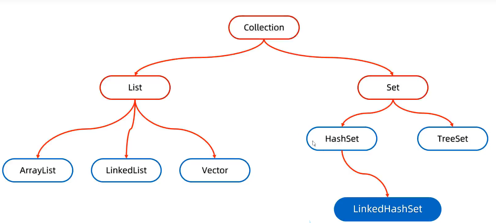

# java
暂无
<!-- more -->

## 基础
### 封装
### 继承
### 多态  
调用成员变量：编译看左边，运行看左边。  
调用成员方法：编译看左边，运行看右边。  
若父类中没有成员变量或方法，怎么都编译不通过。
### 权限修饰符  
访问权限修饰符有四种：private< default < protected < public。

## java数据结构
### 字符串
1. **String**：字符串，不可变对象。   
2. **StringBuilder**：常用于单线程中，多线程使用不安全。
3. **StringBuffer**：线程安全的，使用内部锁（这个锁是由对象本身提供的）来控制对它的访问，用于构建字符串。
4. **StringJoiner**：可以指定分隔符和开头结尾，用于构建字符串。  

其中java底层对StringBuilder进行过处理，如果打印他的对象不会返回对象的地址值，而是属性值。


### 队列和栈

如果想要一个int类型数组，可以使用如下代码：
```java
var array = nums.stream().mapToInt(i -> i).toArray();
```
### 集合

#### List列表 
1. **ArrayList**：动态数组，支持随机访问。
2. **LinkedList**：链表，支持插入和删除操作。
3. **Vector**：线程安全的 ArrayList，支持同步访问。     

**列表转数组方法**  
```java
Object[] array = list.toArray();  
```
该方法返回的是一个 Object 数组，而不是 T[] 类型的数组。如果想要一个Integer数组，可以使用如下代码：
```java
Integer[] array = nums.toArray(new Integer[0]);
```  
通过new Integer[0]来避免自动装箱为Object[]，而因为0的存在限制了箱子大小，toArray()会创建一个大小合适的新数组。  
**注意：** Integer数组存储的是对象引用，每个引用占用4个字节（在32位和64位的JVM中），但每个Integer对象本身在堆上分配，所以实际上占用的内存更多。    
##### ArrayList  
ArrayList的实现结构为数组，底层原理如下： 
1. 不放数据默认容量为0。
2. 当第一次放入时候，会创建一个长度为10(默认)的数组。
3. 当数组大小不够时，会自动扩容(使用Arrays.copyOf)，扩容规则为：  
   1. 若能放下，则扩容为1.5倍。
   2. 若放不下，则扩充为加入新元素后的新数组大小。
##### LinkedList  
LindkedList的实现结构为链表，支持插入和删除操作,查询慢,增删快。

#### Set   
1. **HashSet**：基于哈希表的无序集合，不允许重复元素,且包含LinnkedHashSet。
2. **TreeSet**：基于红黑树的有序集合，不允许重复元素。
##### HashSet和LinkedHashSet
HashSet的实现结构为数组加链表加红黑树，底层原理如下：  
1. 创建一个默认长度为16，默认加载因子为0.75的数组。  
2. 根据哈希值计算得到应该存入的位置。  
   ```
   int index = (数组长度 -1) & 哈希值
   ```  
3. 当发生哈希碰撞时，使用equals方法判断，一致的话则去重，否则采用链表挂在后方。
4. 当数组大小不够时，会自动扩容，扩容规则为：  

   1. 超过75%时，会自动将数组长度翻倍。  
   2. 链表长度大于8，且数组长度大于64，转为红黑树。
**注意**:当hash用来存储对象时，需要重写hashCode()和equals()方法，否则无法去重，因为原来是根据地址生成的hashCode，会导致相同对象存到不同位置。   

LinkedHashSet跟HashSet一样，区别在于会用一个双向链表保存插入的顺序，因此可以保持插入的顺序。    
##### TreeSet
TreeSet的实现机制为红黑树，不需要重写equals和hashCode方法，底层原理：当插入元素时，通过比较(默认使用comparabel接口，无法比较则需要构造比较器)构建红黑树。比较差值为0，则舍弃。

## 函数编程
### Stream
Stream流主要用在集合（Collection）类型数据的处理上，例如：过滤、映射、排序、查找等。  
1. **过滤**：使用 `filter()` 方法，根据给定的条件（例如，大于 5）来过滤出符合条件的元素。
2. **映射**：使用 `map()` 方法，将集合中的每个元素应用一个函数，得到一个新集合。
3. **排序**：使用 `sorted()` 方法，对集合进行排序。
4. **查找**：使用 `findAny()` 或 `findFirst()` 方法，返回流中的任意一个元素或第一个元素。
5. **收集**：使用 `collect()` 方法，将流中的元素收集到一个集合中。collect 方法是 Terminal Operation，这意味着一旦执行了 collect 操作，流就会被消费，不能再被使用。
```java
List<Integer> list = Arrays.asList(1, 2, 3, 4, 5);
List<Integer> result = list.stream()
                           .filter(n -> n > 5) // 过滤出大于5的元素
                           .map(n -> n * 2) // 映射每个元素乘以2
                           .sorted() // 对结果进行排序
                           .collect(Collectors.toList());
```
返回HashMap中最大的值如何操作：
```java
return map.entrySet().stream().mapToInt(Entry::getValue).max().orelse(0);
```
以下根据二进制1数目排序：
```java
  return Arrays.stream(arr)
                .boxed()
                .sorted(Comparator.comparingInt(Integer::bitCount).thenComparingInt(Integer::intValue))
                .mapToInt(Integer::intValue)
                .toArray();
```

### Collections
在 Java 中，`Collections` 是一个位于 `java.util` 包中的类，它包含了一系列静态方法，用于操作和返回集合（Collection）类型的实例。这些方法主要用于对集合进行排序、搜索、替换、倒转等操作。以下是一些常用的 `Collections` 类方法：
1. **排序**
   - `sort(List<?> list)`: 按自然顺序对指定列表进行排序。
   - `sort(List<?> list, Comparator<? super T> c)`: 按提供的比较器对列表进行排序。

2. **搜索和替换**
   - `binarySearch(List<? extends Comparable<T>> list, T key)`: 在自然排序的列表中二分查找指定元素。
   - `binarySearch(List<? extends T> list, T key, Comparator<? super T> c)`: 在使用比较器排序的列表中二分查找指定元素。
   - `max(Collection<? extends T> coll)`: 返回集合中的最大元素。
   - `min(Collection<? extends T> coll)`: 返回集合中的最小元素。
3. **替换**
   - `replaceAll(List<?> list, Object oldVal, Object newVal)`: 将列表中所有等于 `oldVal` 的元素替换为 `newVal`。
4. **倒转**
   - `reverse(List<?> list)`: 反转列表的顺序。
8. **空集合**
   - `emptyList()`: 返回一个空的、不可修改的列表。
   - `emptySet()`: 返回一个空的、不可修改的集合。
   - `emptyMap()`: 返回一个空的、不可修改的映射。


