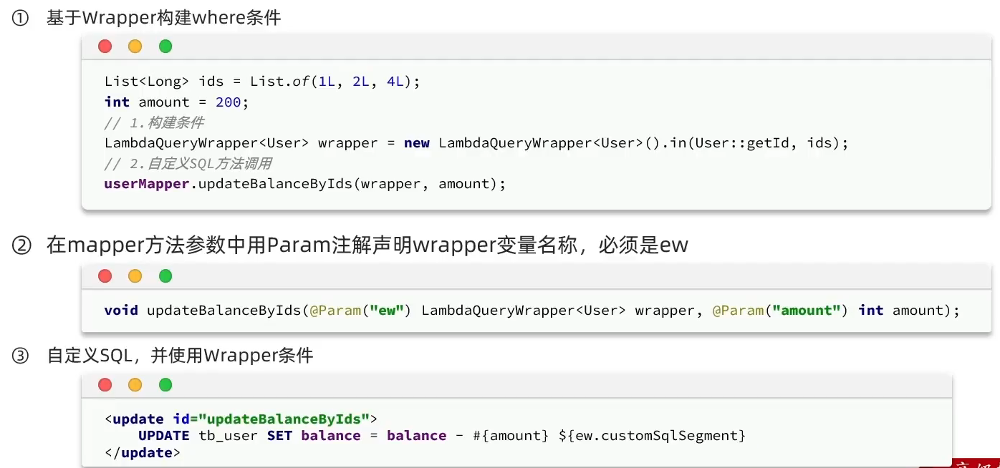
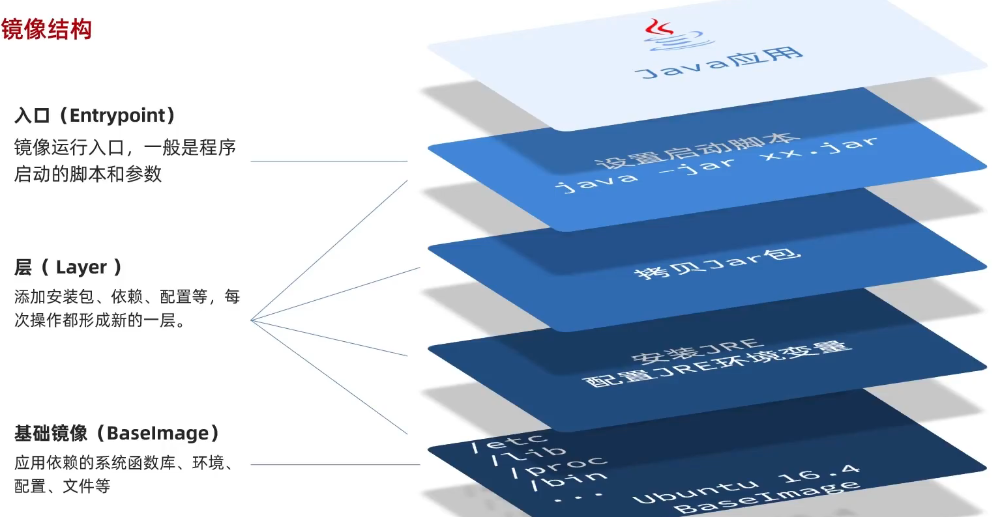

# 工具相关
记录写Spring使用过程中常用的一些工具。
<!-- more --> 
## Servlet
用于开发服务器端应用程序，运行再web服务器上如tomcat。HttpServlet 是一个抽象类，继承自 GenericServlet 类，专门用于处理 HTTP 请求。  


**HTTP请求数据格式**：  
1. 请求行：请求方式 请求url 请求协议/版本锁定  
2. 请求头：请求头信息  
3. 请求空行：空行，用来分割头部分和体部分
4. 请求头：正文  

Get： 请求参数在请求行中，也就是拼接在url后。且请求url长度有限制，且不安全。不会产生中文乱码。  

Post：请求参数在请求体中。请求url长度没有限制，因此图片上传用post。会产生中文乱码，需要序列化。  

**请求头中信息**：  
  
  - UserAgent：告诉服务器，访问使用的浏览器信息。以便跨平台。  
  -  Aceept：告诉服务器我能接受的信息格式。
  - Referer：告诉服务器，(我)从哪里来。用于防盗链和统计用户信息。
  - Connection ：是否保持长连接。(keep-alive)则可以被复用。
  
**请求转发步骤：**    

浏览器访问地址不变，只能在服务器内部转发，且仅仅有一次请求（转发前），一个有作用范围的对象，可以在范围内共享数据，一般请求转发的多个资源中共享数据方法。

1. 通过requst对象获取请求转发其对象RequestDispatcher requestDispatcher(String path).（不同于Spring中使用HttDispatcherServlet转发到控制器中）. 
2. 通过RequestDispatcher对象来进行转发foward(ServletRequest req, ServletResponse resp)


## Mybatis及Plus
笔记未完成状态。
<!-- more -->
### Mybatis
#### 参数占位符  
- ```#{...} ```
  - 执行SQL时，会将#{...}替换为？，生成预编译SQL，会自动设置参数。
  - 使用时机：参数传递时，都使用#{...}。
- ```${...}```
  - 拼接SQL,直接将参数拼接到SQL语句中，存在SQL注入问题。登录密码千万不要这样设置。
  - 使用时机，如果对表明，列表名进行动态设置时。
#### XML映射标签  
- ```<if>```
- ```<where>```
- ```<set>```
- ```<foreach>```
- ```<sql> ```
- ```<include>```
- ```<association>```: 关联对象,处理多对一的关联。
- ```<collection>```：关联集合，处理一对多的关联。
- ```<resultMap>```：将结果映射到实体类中。resultMap可以配合标签association或collection来实现级联查询。这两个标签内除了常见属性property、column之外，还可以设置其他属性，如javaType来指定实体类中参数类型(可以为对象类型)、select语句，实现多表查询。
### Mybatis-Plus 
mp约定大于配置,mapper只需要继承BaseMapper即可。  
#### 常见注解
- ```@TableName```: 默认表名是类名下划线转换，如果不是，则需要添加该注解。
- ```@TableId```: 指定主键，默认是id，如果没有id字段，则需要添加该注解。
- ```@TableField```: 指定数据库字段，默认是属性名，**如果数据库字段和属性名不一致**，则需要添加该注解。**如果数据库字段名is开头**，则需要添加@TableField(value = "is_xxx")，否则会报错。**如果成员不是数据库字段**，则需要添加@TableField(exist = false)。
#### 核心功能
1. 条件构造器：
- QueryWrapper和LambdaQueryWrapper，用于构造增删改查的where条件部分。
- UpdateWrapper和LambdaUpdateWrapper，通常只在有set的语句中使用。
- 尽量使用LambdaQueryWrapper和LambdaUpdateWrapper，避免硬编码。
2. 自定义SQL
  
3. IService接口  
IService接口和ServiceImpl实现类是MP中的另一功能。其实现了CRUD功能，可以简化开发。只需继承即可。
- lambda方法  
如lambdaQuery，lambdaUpdate等。主要处理复杂逻辑。小于函数lt，小于等于le，大于gt，大于等于ge等。如：
```Java
return lambdaQuery()
        .like(name != null,User::getName, name)
        .eq(age != null,User::getAge, age)
        .eq(User::getSex, sex)
        .list();
```
4. Db静态工具类  
Db.lambdaQuery() 是一个静态方法，可以在任何地方使用，不需要依赖注入。
```Java
return Db.lambdaQuery(User.class)
.between(age != null, User::getAge, ageStart, ageEnd)
.groupBy(User::getSex)
.having(age != null, "avg(age)>?", age)
```
5. 逻辑删除  
MP提供逻辑删除功能，无需改变调用方法，直接在底层帮我们自动修改CRUD操作。只需要在application.yml中配置即可。
```Java
mabatis-plus:
  global-config:
    db-config:
      // 逻辑删除字段名,数据类型可以是booolen or int
      logic-delete-field: delFlag 
      logic-delete-value: 1
      logic-not-delete-value: 0
```
6. 分页插件
## Maven  
Maven是一个项目管理和构建自动化工具,它使用一个名为 POM（Project Object Model）的 XML 文件来描述项目的构建过程、依赖关系和其他配置。
- 继承与聚合？
- 聚合工程？  
标签```<modules> ```
- 版本锁定？  
标签```<Dependencymanage>```  

## Redis  
是一个开源的键值存储系统，通常用作数据库、缓存和消息代理。  
- 字符串(String)
  - set key value：设置指定key的值
  - get key：获取指定key的值
  - setex key seconds value：设置指定key的值，并将key的过期时间设为seconds秒
  - setnx key value 只有在key不存在时设置key的值
- 哈希(Hash)
  - HSET key field value：将哈希表 key 中的字段 field 的值设为 value
  - HGET key field：获取存储在哈希表中指定字段的值。
  - hdel key field:删除哈希表中指定字段
  - hkeys key：获取哈希表中所有字段
  - hvals key：获取哈希表中所有值 
- 列表(List)
  - l(r)push key value:将一个或者多个插入到列表头部(尾部)
  - l(r)pop key value:移除一个或者多个列表头部(尾部)元素
  - llen key：获取列表长度
- 集合(Set)
  - sadd key member:向集合中加入一个或多个成员
  - srem key member:删除集合中的一个或多个成员
  - sinter key1 [key2]:求交集
  - sunion key1 [key2]:求并集
- 有序集合(Sorted Set)
  - zadd key socre member:向有序集合中添加一个或多个成员
  - zrem key member:移除有序集合中一个或多个成员
  - zrange key start stop:通过索引区间返回指定区间的成员
  - zincrby key increment member:对指定成员加上分数增量increment
- 通用命令
  - keys parttern:查找给定模式的key
  - exists key:检查是否存在key
  - type key:返回key所储存的值的类型
  - del key:存在时删除key 
## MySQL
拼接&rewriteBatchedStatements=true实现批量插入。  

1. 在MySQL中，查询结果的顺序并不总是按照你在IN列表中指定的顺序返回。这是因为MySQL的查询结果顺序主要取决于数据的存储方式和MySQL的内部优化机制。
```sql
SELECT * FROM your_table WHERE id IN (id1, id2, id3) ORDER BY FIELD(id, id1, id2, id3);
```

### 多表联合
处理关联问题：  
- 同步存储：增加新的字段，在班级表中增加新的字段学生数量来进行维护。  
    - 优点：
      查询数量时只需要单表查询，执行速度快  
    - 缺点：
      需要维护额外的字段，维护成本高  
- 关联查询：编写关联查询语句，在mapper层进行封装。
  - 优点：不需要额外的字段进行维护
  - 缺点：查询较慢，当N较大时不适用    

处理级联问题：
 - 级联查询：通常是指对象关系映射(ORM)中，即在查询时，将关联对象也查询出来。在mybatis中，使用association或collection标签来完成。
## Kafka
Kafka 是一个开源的分布式事件日志系统，单机吞吐量10w左右。
- 应用场景
  - 异步处理:将一些比较耗时的操作放在其他系统中
  - 系统解耦:减少不同微服务之间的耦合性
  - 流量削峰:根据消息队列高吞吐特性解决
  - 日志处理(大数据领域)
- 两种模型  
1. 生产者、消费者模型:不必保证消息的顺序，和消息持久化。
2. 消息队列模式:必须保证消息的顺序性，和消息持久化。其中包括点对点，一对一。和发布订阅，一对多两种形式。
## docker
docker主要负责镜像管理，和容器化。
1. 主要命令
- dokcer run  
创建一个容器，-p 将容器端口映射到主机端口。-v [数据卷：容器内目录]/[本地目录：容器内目录] 完成数据挂载。
- docker imgaes  
列出所有镜像,使用rmi删除镜像。
2. 数据卷  
由于容器内只包含镜像所需要的一些依赖，直接在容器内进行操作比较麻烦，所以需要将容器内的数据映射到主机。**数据卷**是一个虚拟目录，是容器内目录和主机目录的映射。只需要将数据卷挂载到容器，即可实现主机和容器之间的双向绑定。
通过docker volume --help命令即可查看数据卷的相关命令。
3. 镜像构建

分层打包的原因：方便下次使用。

**前端搭建**：  

```
docker run -d \
  --name nginx \
  -p 80:80 \
  -p 5174:5174 \
  -p 5175:5175 \
  -p 8080:8080 \
  -v /root/nginx/conf/nginx.conf:/etc/nginx/nginx.conf \
  -v /root/nginx/html:/usr/share/nginx/html \
  nginx
```
注意事项：  
配置文件里server_name采用虚拟机ip，location里root指定的是挂载后地址/usr/share/nginx/html。
## Elasticsearch  
基本概念：
 - 倒排索引：将词条进行分词，然后建立倒排索引，将词条和文档进行关联。查询时先查询词条，得到id，再查关联的文档。
 - 文档：要索引的数据，相当于数据库的一行记录。
 - 索引：相同类型文档的集合，相当于数据库一张表。
 - 映射：索引中文档的字段约束，类似于表的字段约束。
 - DSL: 查询语句，类似于SQL,语句本身是json格式。
 - type：字段数据类型。
    - 字符串：text(可分词的文本)、keyword(精确值，品牌，国家，ip不可被分词)
    - 数值：long、integer、short、byte、double、float、half_float、scaled_float
    - 日期：date
    - 布尔：boolean
    - 对象：object
- index：是否创建索引，默认为true。
- analyzer：分词器(只有text需要指定)。  
- properties：嵌套需要，字段的子字段。