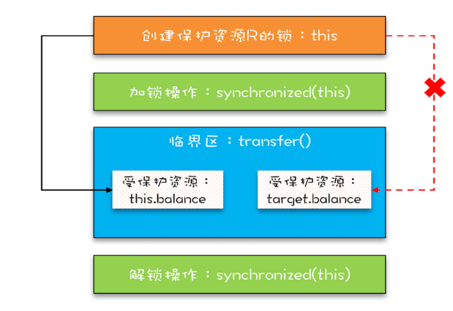

# 并发编程 
本文主要介绍java并发编程
<!-- more -->


## 并发理论基础

### 多线程    
**为什么要使用多线程？**  

在单核时代，多线程主要就是用来平衡 CPU 和 I/O 设备的。如果程序只有 CPU 计算，而没有 I/O 操作的话，多线程不但不会提升性能，还会使性能变得更差，原因是增加了线程切换的成本。  
  
最佳线程数 =CPU 核数 * [ 1 +（I/O 耗时 / CPU 耗时）]  

**多线程的实现方式有哪些？**
  
  
1. 继承Thread类方式实现。重写run方法后调用start方法。  
2. 实现Runnable接口的方式实现。重写run方法，用new Tread(自建类)创建线程对象后调用start方法。
3. 利用Callable接口和Future接口实现。创建Callable对象，然后创建FutureTask对象ft管理运行结果，然后创建Tread对象，调用start方法，new thread(ft，“futuretask对象实例”).start()(**调用get方法会阻塞主线程，因此需要将futuretask放入到一个新线程中**),最后调用ft.get()获取结果。
4. 线程池方式实现。  
  
总体来说分别创建1，2，3个对象。其中想获取结果就是用Callable方式。第一种方法扩展性差，因为单继承的原因只能继承一个类，所以只能继承Thread类，而继承Thread类就无法继承其他类了,且第一种和第二种方法有如下关系：Tread类实现了Runnable接口。用到了设计模式中的策略模式。

**线程优先级，守护线程，出让线程，插入线程** 

- 线程优先级默认为5，范围是1-10，优先级高的线程会优先执行。   
- 守护线程只有当其他非守护线程结束时，守护线程才会结束。通过设置setDaemon(true)方法即可。     
- 礼让线程，通过在run中插入Thread.yield()方法，让当前线程放弃CPU，让CPU去执行其他线程。
- 插入线程，通过.join()方法，将线程插入到当前线程之前运行。  


**线程的生命周期**   

创建线程对象后调用start方法，线程对象进入三态中的就绪态，等待CPU调度。当线程对象运行结束，也就是run()执行完毕，线程对象进入结束状态。  


**ThreadLocal?**   

Java如何解决原子性问题ava 的 ThreadLocal 是一个非常有用的类，用于在多线程环境中为每个线程提供独立的变量副本。它主要用于解决线程安全问题，特别是在使用共享对象时。主要可以避免共享资源竞争并简化同步需求，然而并不能解决所有线程安全问题，例如复合操作，+1或者-1，亦或者是跨线程的通信问题。


### Java并发  


**Java并发编程BUG的源头？？**  

可见性（Visibility）、原子性（Atomicity）和有序性（Ordering），它们是保证并发程序正确性的关键因素：
- 可见性：主要是由缓存会导致可见性问题
- 原子性：由于cpu线程切换带来的原子性问题
- 有序性：编译优化带来的有序性问题，优化后创建对象的顺序：分配内存，赋地址值，初始化对象。  

**Java如何解决线程可见性和有序性问题？**  
  
主要依靠Java内存模型(JMM)的Happens-Before原则，Java 内存模型规范了 JVM 如何提供按需禁用缓存和编译优化的方法,主要用来屏蔽各种硬件和操作系统的内存访问差异。Happens—Before原则有如下六点规则：  
1. 程序顺序性规则：程序顺序性规则，程序执行顺序是按照代码的顺序来执行的。前者对于后者是可见的。  
2. volatile变量规则：禁用cpu缓存，保证可见性，对一个volatile变量的写操作会Happens-Before于后续对这个变量的读操作。  
3. 传递性：线程A对线程B的写操作Happens-Before于线程C的读操作，线程B对线程C的写操作Happens-Before于线程C的读操作。可以结合1和2，保证可见性。  
4. 管程中锁的规则：加锁同步锁也可以维护前者的可见性。  
5. 线程的start()规则：主线程启动子线程，子线程能够看到主线程之前的操作。
6. 线程的join()规则：主线程等待子线程结束，子线程结束之后，主线程能够看到子线程的操作。


**Java如何解决原子性问题？**
  
一般是通过互斥锁保证，但是简单的互斥锁是无法保证原则性的，简单的锁只能保证锁住临界区的一段代码，这样就仍然会造成并发问题，只有在这个锁的基础上加一个对受保护资源的锁，才能保证原子性。下面给出两个存在并发问题的示例：  

@::: code-tabs
#shell
@tab 单锁没有保证可见性
```java  
class SafeCalc {
  long value = 0L;
  long get() {
    return value;
  }
  synchronized void addOne() {
    value += 1;
  }
}
```
@tab 双锁没有保证可见性
```java
class SafeCalc {
  long value = 0L;
  long get() {
    return value;
  }
  synchronized void addOne() {
    value += 1;
  }
}
```
:::  

**受保护资源和锁之间合理的关联关系应该是 N:1 的关系**，其中第二个例子中，对于静态变量的锁所得是类，而对于方法的锁锁的是类的实例，是两把锁，但是没有确保addOne方法对于get方法的可见性。而且多吧锁是锁不住一个资源的，一个厕所n个门是并行的。  
但是如果N：1中的N是有关联关系的，那就不能用一把锁了。  
      

  
**死锁问题？**  
  
为了提升锁的性能，往往使用细粒度锁不锁整个类，但是细粒度锁会带来死锁问题，死锁的触发条件需要满足如下条件：  
1. 互斥：一个资源每次只能被一个进程使用。  
2. 占有等待：一个进程因请求资源而阻塞时，对已获得的资源保持不放。
3. 不可抢占：进程已获得的资源，在未使用完之前，不能强行剥夺。
4. 循环等待：若干进程之间形成一种头尾相接的循环等待资源关系。

比较好破坏的是占用等待和循环等待，通过一次分配完所有资源或者对资源排序满足破坏循环等待条件。而互斥和不可抢占条件java是无法破坏的。下面讲一下java中运用**等待-通知机制**来解决占有等待的问题。
```java
Synchronized(lock){
    while(条件不满足) {
        wait();
    }
    doSomething();
    notifyAll();
}
```
申请资源时候，如果条件不满足，调用wait()方法释放锁并阻塞线程，当释放资源后，调用notifyAll()方法唤醒线程，继续尝试获取锁执行。  


**安全性、性能问题**  
  
对于安全性问题，是否加了锁就一定安全，换句话说线程安全的类例如Vector是否一定安全？  
```java
void addIfNotExist(Vector v, 
    Object o){
  if(!v.contains(o)) {
    v.add(o);
  }
}
```  
答案是否定的，虽然加锁Vector解决了多线程**数据竞争**问题，但是无法解决**竟态条件**，所谓竞态条件，指的是程序的执行结果依赖线程执行的顺序。这种组合问题，显然不满足原子性。  
  
对于性能问题，使用“锁”要非常小心，我们要尽量减少串行，那串行对性能的影响是怎么样的呢？假设串行百分比是 5%，根据阿姆达尔定律，那么我们无论采用什么技术，最高也就只能提高 20 倍的性能。  
  
## JUC并发编程
JUC是java中的并发编程解决方案，是java.util.concurrent包中一系列方法。  
### JUC辅助类
**如何实现锁的可计数**    
  

1. CountDownLatch  

适用于一个或多个线程等待一个事件，当该事件发生时，即计数器减为0，所有线程继续执行。
```java
ConuntDownLatch latch = new ConuntDownLatch(5);
new Thread(()->{
  // 一系列操作完成后 
  latch.countDown();
}).start();
// 等待所有线程执行完成
latch.await();
// 继续执行主线程
```    

2. CyclicBarrier  
  
CyclicBarrier循环栅栏更适合用于一组线程互相等待的场景，并且可以重复使用。  
```java
int numberOfThreads = 5;
CyclicBarrier barrier = new CyclicBarrier(numberOfThreads, () -> {
  System.out.println("所有线程已到达屏障点，继续执行后续操作");
});
for (int i = 0; i < numberOfThreads; i++) {
  new Thread(() -> {
      // 模拟一系列操作
      System.out.println("线程 " + Thread.currentThread().getName() + " 正在执行任务");
      try {
          Thread.sleep(1000); // 假设任务需要1秒时间
      } catch (InterruptedException e) {
          e.printStackTrace();
      }
      // 到达屏障点
      try {
          barrier.await();
      } catch (Exception e) {
          e.printStackTrace();
      }
  }).start();
}
```
**如何实现并发访问控制？**  

使用semaphore信号量解决，acquire()方法获取一个许可，release()方法释放一个许可。

```Java
// 定义信号量数量
Semaphore semaphore = new Semaphore(5);
try{
  // 尝试进入
  semaphore.acquire();
}finally{
  // 释放
  semaphore.release();
}
```
### 线程池  

**创建线程池的方法和工作流程**
```Java
// 一个线程池N个线程
ExecutorService threadPool = Executors.newFixedThreadPool(5);
// 一个线程池一个线程
ExecutorService threadPool = Executors.newSingleThreadExecutor();
// 一个线程池N个线程，可自动调节线程数量
ExecutorService threadPool = Executors.newCachedThreadPool();

threadPool.execute(()->{}(新的runnable接口))
```  
其中线程池的创建底层使用的都是ThreadPoolExecutor类，并且需要传入7个参数，除了四个基本信息外还有3个参数，分别是：workQueue，threadFactory，handler，工作队列，线程工厂和拒绝策略。以下为自定义线程池的代码，通常是不适用Executors创建线程池的，因为要么线程不够要么线程过多：  
```Java
 ThreadPoolExecutor tp = new ThreadPoolExecutor(
                corePoolSize:2,
                maximumPoolSize:5,
                keepAliveTime:2L,
                unit:TimeUnit.SECONDS,
                workQueue:New ArrayBlockingQueue<>(3),
                threadFactory:Executors.defaultThreadFactory(),
                handler:new ThreadPoolExecutor.AbortPolicy()
        );
```

线程池的工作流程如下：    

定义线程池中有一个比较关键的参数是最大线程数量和核心线程数量也就是常驻线程数量。随着任务数的增多，有以下处理顺序。
1. 首先任务由常驻线程处理。  
2. 常驻线程不够之后加入阻塞队列等待常驻线程处理。
3. 阻塞队列满了之后，再创建临时线程处理任务。
4. 临时线程数+常驻线程达到最大线程数之后，采用拒绝策略拒绝掉新的任务。  
  
常驻线程需要搭配阻塞队列使用，再无法处理才会考虑增加线程。  
 
