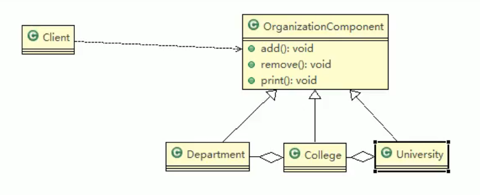

# 设计模式
结合尚硅谷设计模式和书籍《图解设计模式》。首先是基础讲解，然后是各个设计模式。
<!-- more -->
## 类图和七大设计原则   
## 交给子类
交给子类的设计模式主要有两种，模板方法(Template Method)模式和工厂模式，区别在于模板方式相当于一个加工线，关注的是在一系列固定的流程模板中具体某个算法的实现，由子类在父加工线的基础上实现自己的算法步骤，算法步骤流程由父类定义。而工厂模式相当于一个工厂，主要职责是创建对，子类可以通过实现父类的创建逻辑，自由选择创建哪种类型的对象，工厂模式关注的是对象的创建，而非算法步骤的具体实现。

## 生成实例
待总结  
### Singleton模式 - 只有一个实例  
单例模式可以分为静态常量饿汉式，静态代码块饿汉式，线程不安全懒汉式，线程安全懒汉式和同步代码块懒汉式。例如jdk中的RunTime就是经典的单例模式且是恶汉，保证系统中时间只有一个实例。还有SpringBoot中的bean的单例模式比较像饿汉式思想。  
其中饿汉式单例对象由静态属性持有，要提前准备好，防止以后饿的时候才创建。而懒汉式则是在第一次调用的时候才创建，懒得做饭，饿的时候才会去调用创建。  

1. **饿汉式**

通过使用私有的构造函数保证单例，基于类加载器的机制构造实例避免线程安全问题。

::: code-tabs
#shell
@tab 静态常量
```java
public Singleton{
    private static final Singleton singleton = new Singleton();
    private Singleton(){};
    public static Singleton getInstance(){
        return singleton;
    }
}
```
@tab 静态代码块
```java
public Singleton{
    private static final Singleton singleton;
    static{
        singleton = new Singleton();
    }
    private Singleton(){};
    public static Singleton getInstance(){
        return singleton;
    }
}
```
:::

缺点是在装载时候实现实例化，没有达到懒加载的效果，从而导致内存浪费。

2. **懒汉式**    

通过使用私有的构造函数保证单例，但是不是基于类加载器,volatile常用于多线程，一个线程更改后会立即写入堆内存，其他线程可以立即读取。

::: code-tabs
#shell
@tab 线程不安全懒汉式
```java
public class Singleton{
    private static Singleton singleton = null;
    private Singleton(){};
    public static Singleton getInstance(){
        if(singleton == null){
            singleton = new Singleton();
        }
        return singleton;
    }
}
```
@tab 线程安全懒汉式
```java
public class Singleton{
    private static volatile Singleton singleton = null;
    private Singleton(){};
    public static Singleton getInstance(){
        if(singleton == null){
            synchronized(Singleton.class){
                if(singleton == null){
                    singleton = new Singleton();
                }
            }
        }
        return singleton;
    }
}
```
:::  
缺点是线程不安全懒汉式如果高并发会产生多个实例，而线程安全懒汉式通过双重检查避免了懒加载的问题，但缺点是单例对象可能会被反复创建，因为存在gc的问题。一般场景使用懒汉式。  
### Prototype模式-原型模式
不使用对象生成实例，而是使用实例生成实例，可以简化对象的创建过程。不同于单例模式，通过实现Cloneable接口实现原型模式，主要调用Objec中的Clone方法。对于属性全部一致的对象，仍然是不同对象。Spring的bean通过配置属性为prototype，实现原型模式。     
  

1. 浅拷贝：对于数据类型是引用数据类型的成员变量，浅拷贝（默认的clone）会将地址值引用传递，不会创建新的对象。基本数据类型成员变量才会复制。

2. 深拷贝：复制对象所有基本数据类型成员变量值，为所有引用数据类型成员变量申请存储空间，需要拷贝整个对象。如何实现深拷贝有如下两种方法：  
    - 通过重写clone方法对每一个引用数据类型单独处理，重新clone一个出来，需要一个一个处理。
    ```Java
            @Override
        public Rectangle clone() throws CloneNotSupportedException {
            Rectangle cloned = (Rectangle) super.clone();
            cloned.topLeft = (Point) topLeft.clone(); // 深拷贝 Point 对象
            cloned.bottomRight = (Point) bottomRight.clone(); // 深拷贝 Point 对象
            return cloned;
        }
    ```
    - 通过对象序列化来实现深拷贝(推荐),将对象序列化出去，再序列化回来，不需要针对每一个引用数据类型一个一个处理。在Java中，序列化和反序列化过程中对于引用数据类型的行为是创建新的空间来存储序列化的数据。
    ```Java
     // 将对象序列化到字节流
        ByteArrayOutputStream bos = new ByteArrayOutputStream();
        ObjectOutputStream oos = new ObjectOutputStream(bos);
        oos.writeObject(this);

        // 从字节流中反序列化对象
        ByteArrayInputStream bis = new ByteArrayInputStream(bos.toByteArray());
        ObjectInputStream ois = new ObjectInputStream(bis);
        return (Rectangle) ois.readObject();
    ```
### Builder模式-建造者模式  
建造者模式是一种创建型模式，用于构建复杂对象。它将一个复杂对象的构建与其表示分离，使得同样的构建过程可以创建不同的表示。建造者模式中有一下3个角色：  
- Builder：抽象建造者，定义创建产品各个组成部件的抽象接口，并不强制要求实现。  
- ConcreteBuilder：具体建造者，实现抽象建造者接口中定义的方法，实现创建产品的各个部件。
- **Director**：指挥者，负责安排具体建造者按照要求**完成复杂对象的创建**，由指挥者确定流程，这点不同于**模型方法**模式流程已经固定。
  
java中StringBuilder的源码类似于建造者模式思想，其中：  
- Appendable(抽象建造者)接口定义了多个appende抽象方法。
- AbstractStringBuilder(具体建造者)实现了接口方法。
- StringBuilder(指挥者又是建造者)  
## 分开考虑  
### Bridge模式-桥接模式  

这个图展示的还是不够形象，桥接模式主要思想是吧类的功能抽象结构和类的实现结构分开，桥接模式中和左边的形状是个抽象类，下面继承实现了不同的类，都通过聚合右边实现功能层次和实现结构的分离。由n*n的类体量变成了n+n。其中JDBC就有点像
### Strategy模式-策略模式  
策略模式更关注的是策略的转换，其实跟桥接模式有点类似，通过将对象聚合一个策略接口，然后创建对象实例的时候就可以选择不同的策略，从而实现这个对象和策略的解。Arrays.sort方法就使用了策略模式，因为comparator参数本身是一个接口，它下面就可以实现不同的策略。  
如线程中Runable接口，Runnable接口本身类似于策略模式中的策略接口，它定义了一个算法的框架（即run()方法）.现Runnable接口的类类似于策略模式中的具体策略类，每个类都实现了具体的run()方法，定义了具体的任务逻辑.Thread类类似于策略模式中的上下文（Context），它持有一个策略对象（即Runnable对象），并调用策略对象的run()方法来执行任务.

## 一致性  
### Decorator模式-装饰模式
装饰模式确保了装饰器（Decorator）和被装饰对象（Component）都遵循同一个接口,具有接口一致性和行为一致性等。代码核心是生成了一个装饰类，这个类里聚合了一个被装饰的父类定义的对象，同时它又可以被各个具体的装饰体继承，代表m对n的装饰关系。在Java中，IO流就是一个典型的装饰模式的应用。例如，BufferedReader 和 DataInputStream 都是装饰器，它们可以用来装饰底层的流对象，以提供更多的功能，如缓冲输入或处理特定的数据类型
### Composite模式-组合模式   
当要处理的对象可以生成一颗树形结构，而且需要对树上节点和叶子节点进行操作，能够提供一致的方式，不用考虑是节点还是叶子。下图部分是有误的，聚合操作时将父亲也就是OriganzationComponent对象聚合到子节点中。

而组合模式和装饰模式的区别在于，装饰模式时两层结构，而组合模式往往是多层的，一层一层的装饰。相同点是不同层都要继承相同的父类。
## 学不动了
因为学不动了，所以学了两个比较重要的，观察者模式和代理模式。
### 观察者模式  
目的是发送状态变化通知。有点像发布订阅的思想,主要有四个角色:
- Subject(被观察者)：抽象主题，定义了添加、删除、通知观察者的方法，同时聚合了抽象的Observer对象。
- ConcreateSubject(具体被观察者)：具体主题，实现抽象主题中的抽象方法，具体主题的内部状态发生改变时，给所有注册过的观察者对象**发送通知**。 
- Observer(抽象观察者)：抽象观察者，定义了更新接口，当接到主题通知时进行响应。
- ConcreateObserver(具体观察者)：具体观察者，实现抽象观察者定义的更新接口，以便在得到主题通知时更新自身的状态。可以有多个不同观察者，实现N对1的观察订阅。
java中有根据这个实现的类Observer，还有Observable，但是jdk9后被弃用。  
### 代理模式    
只在必要时生成实例，避免浪费。  
- 静态代理：有点像装饰模式，在代理类里通过聚合父接口的方法聚合一个被代理类，然后调用被代理类的方法。
- 动态JDK代理：代理对象不需要实现接口，目标对象仍需要，代理对象的生成是利用JDK的API，动态的在内存中构建一个代理对象(反射机制)。
- 动态Cglib代理：Cglib也叫子类代理，主要用于处理目标对象并没有实现一个接口的情况，使用目标对象子类来实现代理。底层是通过字节码处理框架ASM来转换字节码并生成新的类。
