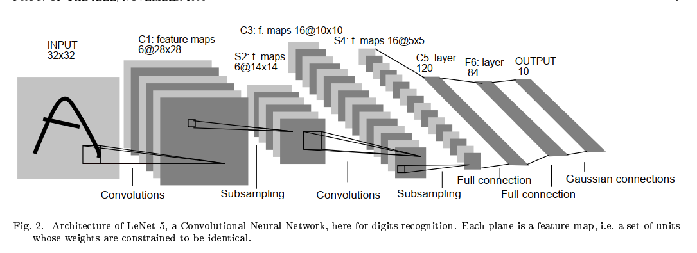

# LeNet
LeNet是由Yann LeCun等人于1998年提出的一个经典卷积神经网络模型，也是第一个成功应用于手写数字识别任务的卷积神经网络。LeNet模型在计算机视觉领域的发展中具有重要的意义，奠定了卷积神经网络的基础。
## 优点
1.提出了卷积神经网络的基本结构：LeNet模型是第一个成功应用于手写数字识别任务的卷积神经网络。它引入了卷积层、池化层和全连接层的组合结构，为后续的深度学习模型奠定了基础。但池化层采取的是平均池化，而不是后来的最大池化。

2.层次化的特征提取：LeNet模型通过卷积层和池化层的组合，实现了对输入图像的多层次特征提取。卷积层用于提取局部特征，而池化层则通过下采样操作减小特征图的尺寸，使得模型能够对不同尺度的特征进行感知。

3.参数共享：LeNet模型中的卷积层使用了共享权重的机制，即多个卷积核共享相同的权重参数。这种参数共享的方式减少了模型的参数量，提高了模型的训练效率和泛化能力。

4.非线性激活函数：LeNet模型使用了非线性激活函数（通常是sigmoid函数），引入了非线性变换，使得模型能够学习复杂的特征表示。

## 模型架构
  
总共过程很简单，就是卷积+池化+卷积+池化+三个全连接。采用的是5×5卷积核，因此（32-5）/1+1=28。至于6个卷积核后面为什么生成了深度为14的卷积层，论文中如下解释：

## 代码
```
# 加载库
import torch
import torch.nn as nn
import torch.optim as optim
import torchvision.datasets as datasets
import torchvision.transforms as transforms


# 定义LeNet-5模型
class LeNet5(nn.Module):
    def __init__(self):
        super(LeNet5, self).__init__()
        self.conv1 = nn.Conv2d(in_channels=1, out_channels=6, kernel_size=5, stride=1)
        self.pool1 = nn.AvgPool2d(kernel_size=2, stride=2)
        self.conv2 = nn.Conv2d(in_channels=6, out_channels=16, kernel_size=5, stride=1)
        self.pool2 = nn.AvgPool2d(kernel_size=2, stride=2)
        self.fc1 = nn.Linear(in_features=16 * 4 * 4, out_features=120)
        self.fc2 = nn.Linear(in_features=120, out_features=84)
        self.fc3 = nn.Linear(in_features=84, out_features=10)

    def forward(self, x):
        x = self.pool1(torch.relu(self.conv1(x)))
        x = self.pool2(torch.relu(self.conv2(x)))
        x = x.view(-1, 16 * 4 * 4)
        x = torch.relu(self.fc1(x))
        x = torch.relu(self.fc2(x))
        x = self.fc3(x)
        return x

train_dataset = datasets.MNIST(root='./data', train=True, transform=transforms.ToTensor(), download=True)
test_dataset = datasets.MNIST(root='./data', train=False, transform=transforms.ToTensor())

# 定义数据加载器
train_loader = torch.utils.data.DataLoader(dataset=train_dataset, batch_size=64, shuffle=True)
test_loader = torch.utils.data.DataLoader(dataset=test_dataset, batch_size=64, shuffle=False)

# 定义模型、损失函数和优化器
model = LeNet5()
criterion = nn.CrossEntropyLoss()
optimizer = optim.Adam(model.parameters())

# 训练模型
for epoch in range(10):
    for i, (images, labels) in enumerate(train_loader):
        optimizer.zero_grad()
        outputs = model(images)
        loss = criterion(outputs, labels)
        loss.backward()
        optimizer.step()

        if (i + 1) % 100 == 0:
            print('Epoch [{}/{}], Step [{}/{}], Loss: {:.4f}'.format(epoch + 1, 10, i + 1, len(train_loader),loss.item()))


# 测试模型
model.eval()
with torch.no_grad():
    correct = 0
    total = 0
    for images, labels in test_loader:
        outputs = model(images)
        _, predicted = torch.max(outputs.data, 1)
        total += labels.size(0)
        correct += (predicted == labels).sum().item()

    print('Test Accuracy: {:.2f}%'.format(100 * correct / total))
```


