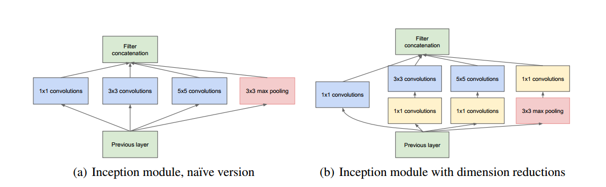

# GoogLeNet
从LeNet-5开始，卷积神经网络(CNN)通常具有标准结构——堆叠的卷积层(可选的是对比度归一化和maxpooling)之后是一个或多个全连接层。这种基本设计的变体在图像分类文献中很普遍，并且在MNIST, CIFAR以及最值得注意的ImageNet分类挑战上产生了迄今为止最好的结果。对于较大的数据集，如Imagenet，最近的趋势是增加层数和层大小，同时使用dropout来解决过拟合问题。  
GoogLeNet是Google在2014年提出的一种深度卷积神经网络架构，它在当时的图像分类任务中取得了很好的效果，并且引起了广泛的关注。它的全名是Inception-v1，因为它的设计思想基于一种称为"Inception module"的模块化结构。 它很好的解决了卷积网络层数深，数据量大的问题。 
## 优点  
1.GoogLeNet的主要贡献是引入了Inception模块，**用密集的模块来近似出局部最优稀疏结构**。根据赫布法则的思想，采用稀疏连接的方式。（像LeNet）

2.采用类似于赫布法则思想，感受野不断增大，卷积核不断增大，由1×1到3×3再到5×5。模型越深3×3再到5×5越多。  

3.用global average pooling全局平均池化代替全连接层的展平操作，依然采用dropout。大大减少了数据量。甚至还增加了top-1准确率，防止过拟合。  

4.增加了两个辅助分类器，辅助分类器在中间层添加，并与全连接层的输出一起用于计算损失函数和进行梯度更新，以提供额外的梯度信号和正则化效果。  
## 模型结构  
1.输入层：接受输入图像。

2.卷积层：使用多个卷积核对输入图像进行特征提取，并将提取的特征映射传递给后续的网络层。

3.Inception模块：是GoogLeNet的核心组件，由多个并行的卷积层和池化层组成，以捕获不同尺度和抽象级别的特征。每个Inception模块由四个分支组成：  

·1x1卷积分支：使用1x1卷积核进行特征提取。  
·3x3卷积分支：使用3x3卷积核进行特征提取。  
·5x5卷积分支：使用5x5卷积核进行特征提取。  
·最大池化分支：使用最大池化操作提取特征。  

这些分支的输出在通道维度上被级联，并作为下一层的输入。Inception模块通过逐层堆叠多次使用，以增加网络的深度和宽度，提高特征提取能力。此外，GoogLeNet还通过使用辅助分类器（Auxiliary Classifier）来帮助网络在训练过程中更好地学习特征表示。辅助分类器在中间层添加，并与全连接层的输出一起用于计算损失函数和进行梯度更新，以提供额外的梯度信号和正则化效果。（反向传播时如果有一层求导为0，链式求导结果则为0）

4.全局平均池化层：对特征图进行全局平均池化操作，将每个特征图的平均值作为特征向量。

5.全连接层：将全局平均池化层的输出连接到一个或多个全连接层，用于最终的分类任务。

6.Softmax层：对全连接层的输出进行Softmax激活，将其转化为表示概率的预测结果。  

  
上图为一个inception模块，右图改进方法中先用1×1降维减少了数据量。   

  
## 代码  
```py
import torch
import torch.nn as nn
import torch.nn.functional as F

class InceptionModule(nn.Module):
    def __init__(self, in_channels, out_channels_1x1, out_channels_3x3_reduce, out_channels_3x3, out_channels_5x5_reduce, out_channels_5x5, out_channels_pool):
        super(InceptionModule, self).__init__()

        # 1x1卷积分支
        self.conv1x1 = nn.Conv2d(in_channels, out_channels_1x1, kernel_size=1)

        # 3x3卷积分支
        self.conv3x3_reduce = nn.Conv2d(in_channels, out_channels_3x3_reduce, kernel_size=1)
        self.conv3x3 = nn.Conv2d(out_channels_3x3_reduce, out_channels_3x3, kernel_size=3, padding=1)

        # 5x5卷积分支
        self.conv5x5_reduce = nn.Conv2d(in_channels, out_channels_5x5_reduce, kernel_size=1)
        self.conv5x5 = nn.Conv2d(out_channels_5x5_reduce, out_channels_5x5, kernel_size=5, padding=2)

        # 最大池化分支
        self.maxpool = nn.MaxPool2d(kernel_size=3, stride=1, padding=1)
        self.conv_pool = nn.Conv2d(in_channels, out_channels_pool, kernel_size=1)

    def forward(self, x):
        out1x1 = F.relu(self.conv1x1(x))
        out3x3 = F.relu(self.conv3x3(F.relu(self.conv3x3_reduce(x))))
        out5x5 = F.relu(self.conv5x5(F.relu(self.conv5x5_reduce(x))))
        outpool = F.relu(self.conv_pool(self.maxpool(x)))
        outputs = [out1x1, out3x3, out5x5, outpool]
        return torch.cat(outputs, 1)


class GoogLeNet(nn.Module):
    def __init__(self, num_classes):
        super(GoogLeNet, self).__init__()

        self.conv1 = nn.Conv2d(3, 64, kernel_size=7, stride=2, padding=3)
        self.maxpool1 = nn.MaxPool2d(kernel_size=3, stride=2, padding=1)
        self.conv2 = nn.Conv2d(64, 192, kernel_size=3, stride=1, padding=1)
        self.maxpool2 = nn.MaxPool2d(kernel_size=3, stride=2, padding=1)

        # Inception模块
        self.inception3a = InceptionModule(192, 64, 96, 128, 16, 32, 32)
        self.inception3b = InceptionModule(256, 128, 128, 192, 32, 96, 64)
        self.maxpool3 = nn.MaxPool2d(kernel_size=3, stride=2, padding=1)

        self.inception4a = InceptionModule(480, 192, 96, 208, 16, 48, 64)
        self.inception4b = InceptionModule(512, 160, 112, 224, 24, 64, 64)
        self.inception4c = InceptionModule(512, 128, 128, 256, 24, 64, 64)
        self.inception4d = InceptionModule(512, 112, 144, 288, 32, 64, 64)
        self.inception4e = InceptionModule(528, 256, 160, 320, 32, 128, 128)
        self.maxpool4 = nn.MaxPool2d(kernel_size=3, stride=2, padding=1)

        self.inception5a = InceptionModule(832, 256, 160, 320, 32, 128, 128)
        self.inception5b = InceptionModule(832, 384, 192, 384, 48, 128, 128)

        self.avgpool = nn.AdaptiveAvgPool2d((1, 1))
        self.dropout = nn.Dropout(p=0.4)
        self.fc = nn.Linear(1024, num_classes)

    def forward(self, x):
        out = F.relu(self.conv1(x))
        out = self.maxpool1(out)
        out = F.relu(self.conv2(out))
        out = self.maxpool2(out)
        out = self.inception3a(out)
        out = self.inception3b(out)
        out = self.maxpool3(out)
        out = self.inception4a(out)
        out = self.inception4b(out)
        out = self.inception4c(out)
        out = self.inception4d(out)
        out = self.inception4e(out)
        out = self.maxpool4(out)
        out = self.inception5a(out)
        out = self.inception5b(out)

        out = self.avgpool(out)
        out = torch.flatten(out, 1)
        out = self.dropout(out)
        out = self.fc(out)

        return out
```
