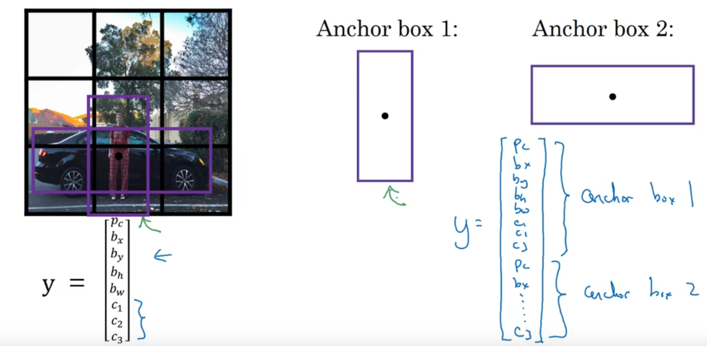

# 算法基础
## 非极大值抑制  
  
**针对于上图**,yolo v3滑动窗口后针对于一个车子可能生成很多个框如何处理呢?
1.去掉p小于0.6的bounding box
2.循环选择p最大的bounding box,去掉与它iou大于0.5的.
## Anchor Boxes

为了解决一个空间内只能检测一种物体的问题,采用ANchor Boxes,即**扩充通道深度,储存多个信息**的方式.其中Yolo v3中就采取了5个anchor boxes.