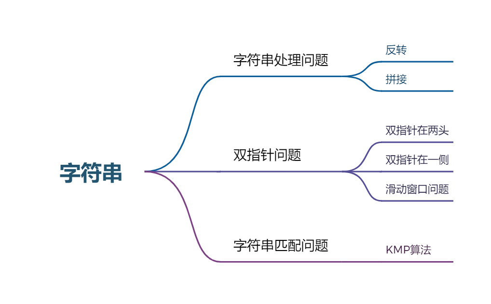

# 字符串

<!-- more -->

## KMP算法
给你两个字符串 haystack 和 needle ，请你在 haystack 字符串中找出 needle 字符串的第一个匹配项的下标（下标从 0 开始）。如果 needle 不是 haystack 的一部分，则返回  -1 。

**示例 1：**

输入：haystack = "sadbutsad", needle = "sad"  
输出：0  
解释："sad" 在下标 0 和 6 处匹配。
第一个匹配项的下标是 0 ，所以返回 0 。

**KMP步骤：**
最总要的是弄明白next数组的含义  


其中下方数字为公共前后缀大小，**规律**为递增时候只能逐次加1（重要）

弄清楚next数组之后则总体的算法流程如下：

称长的被匹配的为主串，短的去匹配的为子串。

1.首先根据字串求出它的next数组。

2.跟主串进行匹配，匹配过程中需要子串需要根据它的next数组不断进行回退（当出现不匹配时）

**时间复杂度：** O(n + m)

**空间复杂度：** O(n + m)

::: code-tabs#shell

@tab java

```java
class Solution {
    //  kmp next数组
    public void getNext(int []next,String s){
        int j = 0;
        next[0]=j;
        // 从长度为2开始匹配才有意义
        for(int i = 1;i<s.length();i++){
            while (j>0 && s.charAt(i)!=s.charAt(j)){
                j = next[j-1];
                // 为什么减一？？？？？？
                // 因为数组从0开始，且next规律是后面如果是2，则前面必定是1				
            }
            if(s.charAt(i)==s.charAt(j)){
                j ++;
            }
            next[i]=j;
        }
    }
    //kmp
    public int strStr(String haystack, String needle) {
        int j = 0;
        int[] next = new int[needle.length()];
        getNext(next,needle);
        for(int i = 0;i<haystack.length();i++){
            // 从长度为2子串开始计算 速度快
            while(j>=0 && haystack.charAt(i)!=needle.charAt(j)){
                j = next[j-1];
            }
            if(haystack.charAt(i)==needle.charAt(j)){
                j++;
            }
            if(j==needle.length()-1){
                return (i-needle.length()+1);
            }
        }
        return -1;
    }
}
```

@tab go

```go
func getNext(s string, next []int) {
	j := 0
	next[0] = j
	for i := 1; i < len(s); i++ {
		for j > 0 && s[i] != s[j] {
			j = next[j-1]
		}
		if s[i] == s[j] {
			j++
		}
		next[i] = j

	}
}
func strStr(haystack string, needle string) int {
	j := 0
	next := make([]int, len(needle))
	getNext(needle, next)
	for i := 0; i < len(haystack); i++ {
		for j > 0 && haystack[i] != needle[j] {
			j = next[j-1]
		}
		if haystack[i] == needle[j] {
			j++
		}
		if j == len(needle) {
			return i - len(needle) + 1
		}

	}
	return -1
}
```
:::
## 双指针问题 
### 定长滑动窗口
模板如下,假设求窗口内和最大：  
```java
public Interger findAns(int[] s){
    int n = s.length();
    int sum = 0,max_sum=0;
    for(int i = 0;i<n;i++){
        // 加入元素
        sum += s.charAt(i)-'0';
        if(i<k-1)
            continue;
        if(sum>max_sum)
            max_sum = sum;
        // 弹出窗口最左侧元素
        sum -= s[i-k+1]; 
    }
    return max_sum;
}
```
