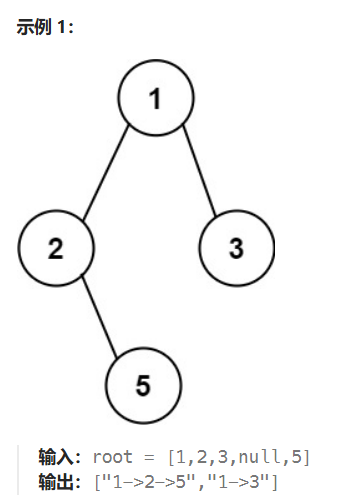

---
tittle: 树
icon: pen-to-square
date: 2024-9-18
category:
  - 算法笔记
timeline: false 
tag:
  - 迭代求特征值
  - 数值分析

--- 

# 树
leetcode刷树笔记
<!-- more -->
二叉树定义：
``` java
public class TreeNode {
    int val;
    TreeNode left;
    TreeNode right;

    public TreeNode() {
    }

    public TreeNode(int node) {
        this.val = node;
    }

    public TreeNode(int node, TreeNode left, TreeNode right) {
        this.val = node;
        this.left = left;
        this.right = right;
    }
}
```
## 二叉树的搜索算法
二叉树的搜索算法主要可以分为两种，一种是BFS，一种是DFS。
- DFS  
即深度优先算法，分为前中后序，一般可采用递归，或者迭代方法（栈）实现，现在给出DFS迭代的java模板：
::: code-tabs
#shell
@tab 前序
```java
public List<Integer> preorderTraversal(TreeNode root) {
    List<Integer> list = new ArrayList<>();
    if (root == null) {
        return list;
    };
    Stack<TreeNode> stack = new Stack<>();
    stack.push(root);
    while (!stack.isEmpty()) {
        TreeNode node = stack.pop();
        list.add(node.val);
        if (node.right != null) {
            stack.push(node.right);
        };
        if (node.left != null) {
            stack.push(node.left);
        }

}
        return list;
}

```
@tab 中序
```java
public List<Integer> inorderTraversal(TreeNode root) {
    ArrayList<Integer> list = new ArrayList<>();
    if (root == null) {
        return list;
    }
    Stack<TreeNode> stack = new Stack<>();
    while (root != null || !stack.isEmpty()) {
        if (root != null) {
            stack.push(root);
            root = root.left;
        }else{
            root = stack.pop();
            list.add(root.val);
            root =root.right;
        }
    }
    return list;
    }
```
@tab 后序
```java
public List<Integer> postorderTraversal(TreeNode root) {
    ArrayList<Integer> list = new ArrayList<>();
    if (root == null) {
        return list;
    }
    Stack<TreeNode> stack = new Stack<>();
    stack.push(root);
    while (!stack.isEmpty()) {
        root = stack.pop();
        list.add(root.val);
        if (root.left != null) {
            stack.push(root.left);
        }
        if (root.right != null) {
            stack.push(root.right);
        }
    }
    Collections.reverse(list);//后序即前序反过来。
    return list;
      }
```


:::
- BFS  
即广度优先算法，通常需要借助队列存储每行的值（迭代），或者采用类似DFS的算法，但是输入变量中加入deep参数（递归），现在给出广度搜索算法的java模板：
```java
public List<List<Integer>> BFS(TreeNode root) {
    List<List<Integer>> result = new ArrayList<>();
    if (root == null) {
        return result;
    }
    Queue<TreeNode> queue = new LinkedList<>();
    queue.offer(root);
    while (root != null) {
        int size = queue.size();
        List<Integer> list = new ArrayList<>();
        for (int i = 0; i < size; i++) {//通过对size采用循环确保每次遍历一个层级
            root = queue.poll();
            list.add(root.val);
            if (root.left != null) {
                queue.offer(root.left);
            }
            if (root.right != null) {
                queue.offer(root.right);
            }
        }
        result.add(list);
    }
    return result;
}
``` 
## 二叉树高度相关
  
给定一个二叉树，判断它是否是平衡二叉树，需要求高度。  
::: code-tabs
#shell
@tab 法1
``` python
    def isBalanced(self, root):
        if not root:
            return True
        return abs(self.height(root.left) - self.height(root.right)) <= 1 and self.isBalanced(root.left) and self.isBalanced(root.right)
    def height(self,root):
        if not root:
            return 0
        return max(self.height(root.left), self.height(root.right)) + 1
```
@tab 法2
```python
    def isBalanced(self, root):
        return height >=0
    def height(self, root):
        if not root:
            return 0
        leftHeight = self.getHeight(root.left)
        if leftHeight == -1: return -1
        rightHeight = self.getHeight(root.right)
        if rightHeight == -1: return -1
        if abs(leftHeight - rightHeight) > 1: return -1
        return max(leftHeight, rightHeight) + 1

```
:::
法一和法二相比时间复杂度更高，为$O(n^2)$,因为递归了两次，但是思想是需要求树的高度。
## 二叉树路径相关

::: code-tabs
#shell
@tab 法1
``` python
    // 递归，深度优先
    def binaryTreePaths(self, root):
        """
        :type root: TreeNode
        :rtype: List[str]
        """
        def construct_paths(root, path):
            if root:
                path += str(root.val)
                if not root.left and not root.right:  # 当前节点是叶子节点
                    paths.append(path)  # 把路径加入到答案中
                else:
                    path += '->'  # 当前节点不是叶子节点，继续递归遍历
                    construct_paths(root.left, path)
                    construct_paths(root.right, path)

        paths = []
        construct_paths(root, '')
        return paths
```
@tab 法2
```python
    def binaryTreePaths(self, root):
        """
        :type root: TreeNode
        :rtype: List[str]
        """
        results=[]
        if not root:
            return results
        nodeQueue = collections.deque([root])
        pathQueue = collections.deque([str(root.val)])
        
        while nodeQueue:
            node = nodeQueue.popleft()
            path = pathQueue.popleft()
            if not node.left and not node.right:
                results.append(path)
            else:
                if node.left:
                    nodeQueue.append(node.left)
                    pathQueue.append(path+"->"+str(node.left.val))
                if node.right:
                    nodeQueue.append(node.right)
                    pathQueue.append(path+"->"+str(node.right.val))
        return results
```
解法思路的关键是要有双队列，且必须是双队列。
## 中序加前/后序确定树
这里拿后序距离，需要递归遍历生成，其中分别递归生成左子树和右子树
``` python
    def buildTree(self, inorder, postorder):
        if not inorder:
            return None
        if len(inorder) == 1:
            return TreeNode(postorder[0])
        
        root = TreeNode(postorder[-1])
        pos = inorder.index(postorder[-1])
        
        root.left = self.buildTree(inorder[:pos], postorder[:pos])
        root.right = self.buildTree(inorder[pos+1:], postorder[pos:-1])
        return root
```