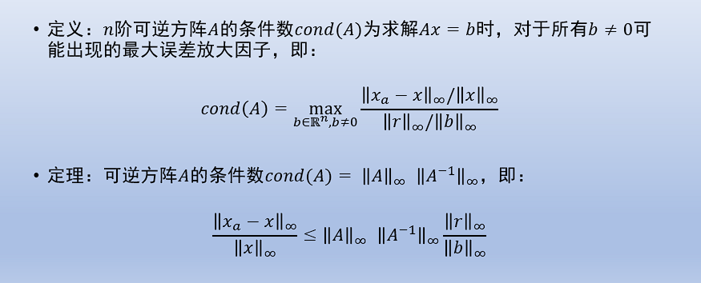

# LU分解
LU分解相较于传统的高斯消元法，虽然具有相同的时间复杂度，但是面对不同的b值并不需要像高斯消元那样多次运行。下面的代码中用一个矩阵存储L和U矩阵。

```
def lu_decomposition(matrix):
    # 只能用于方阵
    if len(matrix)!=len(matrix[0]):
        return False
    n=len(matrix)

    lu_matrix = np.zeros((n,n))
    lu_matrix = lu_matrix.astype(float)


    for i in range(n):
        # 计算上三角矩阵U的元素
        for j in range(i, n):
            sum = 0
            for k in range(i):
                sum += (lu_matrix[i][k] * lu_matrix[k][j])
            lu_matrix[i][j] = matrix[i][j] - sum

        # 计算下三角矩阵L的元素
        for j in range(i + 1, n):
            sum = 0
            for k in range(i):
                sum += (lu_matrix[j][k] * lu_matrix[k][i])
            lu_matrix[j][i] = (matrix[j][i] - sum) / lu_matrix[i][i]

    return lu_matrix

def lu_solve(lu_matrix, b):
    n = len(lu_matrix)

    # 解下三角矩阵方程 LY = B
    y = np.zeros(n)
    for i in range(n):
        y[i] = b[i] - np.dot(lu_matrix[i][:i], y[:i])

    # 解上三角矩阵方程 UX = Y
    x = np.zeros(n)
    for i in range(n - 1, -1, -1):
        x[i] = (y[i] - np.dot(lu_matrix[i][i + 1:], x[i + 1:])) / lu_matrix[i][i]

    return x
```
## 值得注意的
numpy生成的[[ 3 1 2 11]
[ 6 3 4 24]
[ 3 2 5 22]]
和[[3, 1, 2, 11], [6, 3, 4, 24], [3, 2, 5, 22]]的区别： 

从表面上看，这两个输入看起来非常相似，一个是通过字符串表示的二维NumPy数组，另一个是嵌套的列表。然而，实际上存在一个重要的区别，这会导致在应用高斯消元算法时得到不同的结果。

区别在于数据类型。第一个输入通过字符串表示，当使用eval()函数将其转换为NumPy数组时，数组的数据类型将是整数类型。而第二个输入是一个嵌套列表，其中的数字被默认视为整数或浮点数，具体取决于输入时的表示方式。

在高斯消元算法中，除法操作是一个关键步骤，而不同的数据类型可能会导致不同的结果。特别是在整数除法中，结果将被截断为整数部分。这可能会导致计算过程中的舍入误差，从而导致最终结果的差异。
# 误差
## 条件数

其中条件数即$cond(A)$是和最大误差放大因子一样的。其中大条件数的矩阵是***病态的***，这意味着方程组中两个方程的斜率相差很少，因为$A^{-1}$的无穷范数会很大。这就导致计算机在递推求解的时候会求出离真实值较大的值。  
几何解释如下：  
