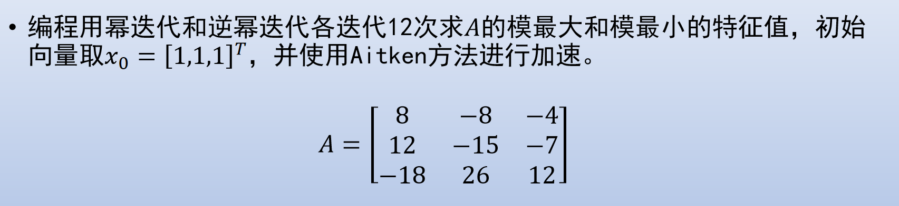

---
tittle: 迭代求特征值
icon: pen-to-square
date: 2023-11-2
category:
  - 课程学习
timeline: false 
tag:
  - 迭代求特征值
  - 数值分析
--- 

# 迭代求特征值

本文主要介绍幂迭代、逆幂迭代求最大最小特征值与QR分解和QR算法。
<!-- more -->

## 幂迭代和逆幂迭代




```python
import numpy as np
```


```python
# 幂迭代
def power_iteration(A, iterations, x, aikten=0, tol=1e-6):
    for _ in range(iterations):
        i = np.argmax(np.abs(x))
        x = x / x[i]
        y = np.dot(A, x)
        t = y[i] / x[i]
        e_1 = np.linalg.norm(y / t - x, ord=1)
        if e_1 < tol:
            return [(t, y)]
        z = np.dot(A, y)
        t = z[i] / x[i]
        e_2 = np.linalg.norm(y / t - x, ord=1)
        if e_2 < tol and e_1 > 100 * tol:
            lambda_1 = np.sqrt(t)
            return [(lambda_1, z + lambda_1 * y), (-lambda_1, z - lambda_1 * y)]
        if aikten == 1:
            x = (x * y - z ** 2) / (z - 2 * y + x)
        else:
            x = z

# 逆幂迭代
def inverse_power_iteration(A, iterations, x, aikten=0, tol=1e-6):
    for _ in range(iterations):
        i = np.argmax(np.abs(x))
        x = x / x[i]
        y = np.linalg.solve(A,x)
        t = y[i] / x[i]
        e_1 = np.linalg.norm(y / t - x, ord=1)
        if e_1 < tol:
            return [(t, y)]
        z = np.linalg.solve(A,y)
        t = z[i] / x[i]
        e_2 = np.linalg.norm(y / t - x, ord=1)
        if e_2 < tol and e_1 > 100 * tol:
            lambda_1 = np.sqrt(t)
            return [(lambda_1, z + lambda_1 * y), (-lambda_1, z - lambda_1 * y)]
        if aikten == 1:
            x = (x * y - z ** 2) / (z - 2 * y + x)
        else:
            x = z

```

**未启用Aikten加速:**  
所得结果如下所示，其中需要迭代12之后刚好收敛。


```python
x = np.array([1, 1, 1])
A = np.array([[8., -8., -4.], [12., -15., -7.], [-18., 26., 12.]])

res = power_iteration(A, 12, x)
inverse_res = inverse_power_iteration(A, 12, x)

print("求解所得特征值数量：", len(res))
print("解得特征值分别为：", [item[0] for item in res])
print("解得特征向量分别为：", [item[1] for item in res])

print("求解所得特征值数量：", len(inverse_res))
print("解得特征值分别为：", [item[0] for item in inverse_res])
print("解得特征向量分别为：", [item[1] for item in inverse_res])

```

    求解所得特征值数量： 1
    解得特征值分别为： [3.9999996821089994]
    解得特征向量分别为： [array([-3.99999873, -3.99999905,  3.99999968])]
    求解所得特征值数量： 1
    解得特征值分别为： [-1.000000178814004]
    解得特征向量分别为： [array([-1.19209293e-07,  5.00000000e-01, -1.00000018e+00])]
    

**启用Aikten加速:**


```python
res = power_iteration(A, 17, x, 1)

print("求解所得特征值数量：", len(res))
print("解得特征值分别为：", [item[0] for item in res])
print("解得特征向量分别为：", [item[1] for item in res])
```

    求解所得特征值数量： 1
    解得特征值分别为： [3.9999996188903744]
    解得特征向量分别为： [array([-3.9999985 , -3.99999887,  3.99999962])]
    

虽然是17步收敛，但是因为代码的原因，原来迭代一次其实是迭代了两次（加入了判断最大特征值绝对值有两个的情况），而且如果判断误差条件改为特征值而非特征向量的话，对特征值进行加速更为合理。


```python
# 艾特肯加速
if _ > 0:
    lambda_estimate = lambda_estimate - (lambda_estimate - lambda_prev) ** 2 / (lambda_estimate - 2 * lambda_prev + lambda_prev_prev)

# 更新迭代变量
    lambda_prev_prev = lambda_prev
    lambda_prev = lambda_estimate
```

## QR分解与QR算法


```python
# QR分解
def qr_decomposition(A: np.ndarray):
    n = len(A)
    Q = np.eye(n)
    for i in range(A.shape[1]):
        t = np.linalg.norm(A[i:,i])
        if t == 0:
            continue
        if A[i,i] > 0:
            t = -t
        v = -A[i:, i]
        v[0] += t
        A[i, i] = t
        A[i+1:, i] = 0
        t_0 = 2/(np.dot(v, v))
        for k in range(i+1, n):
            t = t_0 * np.dot(v, A[i:, k])
            A[i:, k] = A[i:, k] - t*v
        for k in range(n):
            t = t_0 * np.dot(Q[k, i:], v)
            Q[k, i:] = Q[k, i:] - t*v
    return  Q,A
# QR算法
def qr_resolve(A,iterations):
    for k in range(iterations):
        Q,R=qr_decomposition(A)
        A =np.dot(R,Q)
    eigenvalues = np.diagonal(A)
    return eigenvalues
```


```python
A = np.array([[8., -8., -4.], [12., -15., -7.], [-18., 26., 12.]])
print(qr_resolve(A, 25))
```

    [ 4.00000001  1.99999996 -0.99999997]
    
