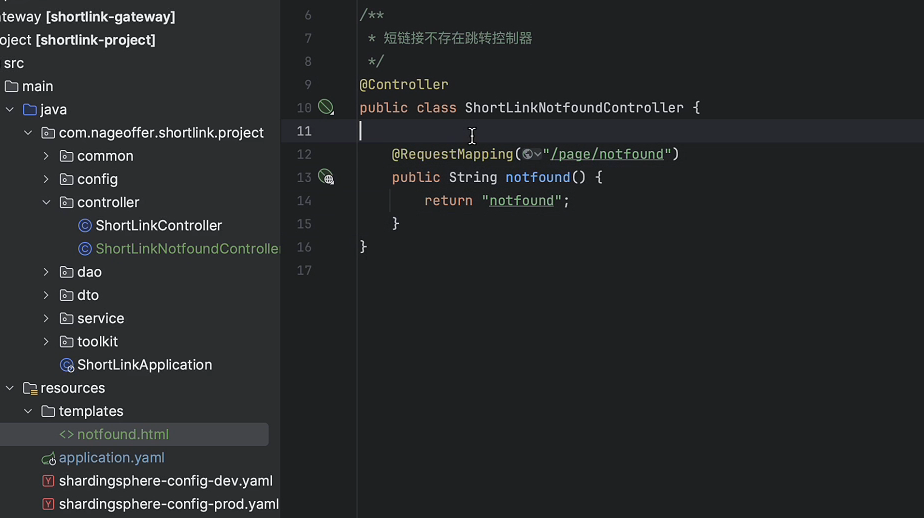

# 短链接
段短短
<!-- more -->    

## 短链接后管系统  

**什么时候分库分表**  
  

分库主要分为垂直模式和水平模式，垂直模式根据业务将数据库拆分为多个数据库，水平模式将相同业务数据库分为多个数据库。  
分表主要分为垂直分表和水平分表，垂直分表根据根据业务维度划分，将不常用的信息放在拓展表中，水平分表根据业务数据量划分，将数据量较大的表分表。  

为什么不使用uri作为分表依据主键？  
  
- 如果将uri作为分表主键会导致分页查询时候出现**读扩散**问题，因为显示的是一个组内的。

什么场景下分表？  
- 数据量过大或者数据库表对应的磁盘文件过大。  
- Q：多少数据分表？ 

什么情况下分库？  
- 连接不够用。  
- MySQL Server 假设支持 4000 个数据库连接。一个服务连接池最大 10 个，假设有 40 个节点。已经占用了 400 个数据库连接。类似于这种服务，有10个，那你这个 MySQL Server 连接就不够了。  
- 一般情况下做读写分离就够了。分库需要复杂的中间件。  

又分库又分表？  
- 高并发写入或查询场景。  
- 数据量巨大场景。 
- ShardingSphere分库分表框架。 

## 中台

**重定向路由表问题**
  
短链接重定向时，用户发送的请求是短链接，然而数据库确实根据分组id来对数据进行分组的，也就是说无法根据用户请求进行查找。所以要有一个根据url来分表的同数量数据表来进行重定向，这些表只包含id，gid和url。

**跳转404页面功能**  
  
当访问的短链接不存在时，跳转404页面功能。实现该功能时需要另外写一个Controller，**并使用@Controller**注解而不是@RestController注解，因为@RestController注解会返回json格式的数据，被@Controller标识的类中的方法返回值会经过SpringMVC中的视图解析器解析并渲染，最终将生成的 HTML 等格式的页面返回给客户端，常用于前后端不分离，返回值优先会在前端文件中适配查找。  
   
  
